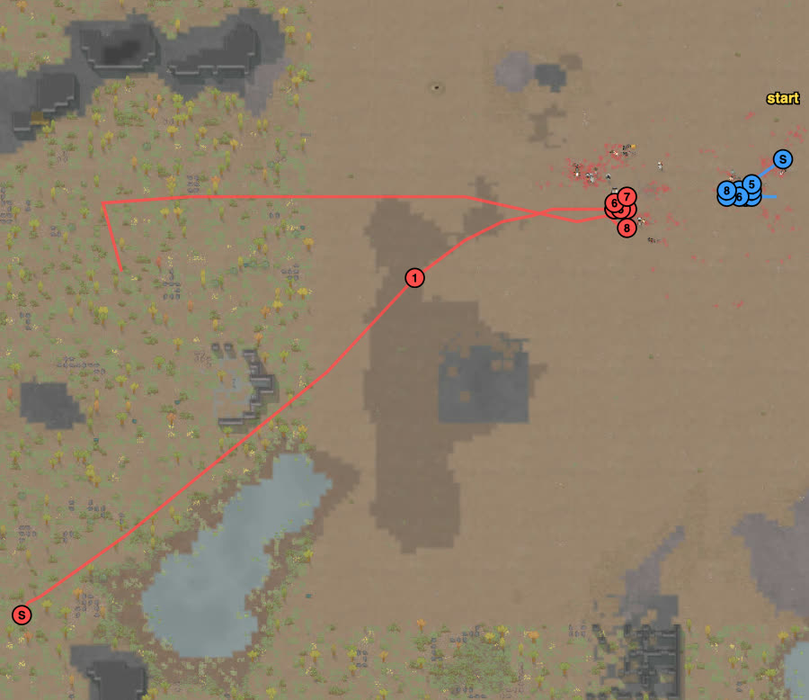

# rand_011 — Claude, 2026-10-05 (replay of the user's game)

Trace `results/human/traces/rand_011_claude_20261005-095453.jsonl.gz` · row `results/human/play.jsonl`
(player `claude`) · result: **repelled** (raid fled t4558), 0 dead, 3 downed (Olaf, Strangler,
Bagad), 0 permanent, HP 334%, raiders out 7 of 9 (2 escaped) · **badness 22.4** (user 25.8,
agent `close` 106.4).
Sheets: none new — this was a replay; the card `cards/rand_011.md` (the user's game with the
user's intentions) was the plan. The user asked for short ticks in battle (tokens are plentiful).

## Card at the start
The user's game, copied: loadout Boss ↔ Bagad (rifle), Diver ↔ Olaf (revolver); two lines on
open ground west of the start, guns in front at x 114–116; Olaf as bait to the south-west; kill
Pablo 3 to 1; then melee-lock the raid's shooters; Mila's Fire spew when two are in reach; frag
dodging (move only the targeted pawn). New for me this game: `hands.brief()` showed Mila's
*Fire spew* and Wanya's *Animal warcall* (no wild animals on the map: useless here).

## Scenes

### t0–390 `raid-far` `us-skill-mismatch` → `loadout` `skirmish-line`
chose: the user's loadout (done t90) and the user's t873 cells.

### t1439–1709 `approach`
saw: at 42–50 cells **every raider targeted the same colonist (Far)**; closer in, each one's
`targeting` became a **cell**: Navarro (91, 123), Reid (98, 114), Zach (98, 115), Dennis (91, 119),
Cameron (91, 118) — the very cells they held in the user's game, 16–23 cells from our front; the
grenadiers' cells were (104, 112–113), 10–12 cells from our front.
followed: the raiders walked to those cells and stopped there.

### t1813–2068 `approach` `us-outrange`
saw: nobody hit after 400 ticks within rifle range; the jobs said "watching for targets".
I thought the rifles were not firing; the `Shots fired` record showed they were (Schlitzer 2,
Boss 2, Diver 4) and missing at 25–30 cells.
chose: attack orders on Shaw (rifles), Reid (Diver) — and re-issued them several times.
followed: Diver hit Reid (84%); the rifles hardly fired: **every new attack order and every
move restarts a bolt-action's ~1.7 s aim**, and I gave many. Boss 87 → 65% (Navarro, Dennis,
Cameron aimed at him).

### t2068–2260 `thrower-close`
saw: Maggie 11 cells from Boss, Shaw on his way to (104, 112).
chose: both lines 4–5 cells east; Olaf out as bait to the south-west (108, 101).
followed: Boss moved slowly (wounded); Diver 100 → 75%.

### t2260–2408 `thrower-close` → `bait` `frag-dodge`
saw: Shaw at (106–107, 114), 9 cells from Olaf.
chose: Olaf to melee-lock Shaw (a grenadier can't throw in melee); guns on Maggie (away from
Olaf); grenades dodged by `hands.guard()` (the frag's target steps ~5 cells away).
followed: **Maggie dead t2364.** Shaw threw at Olaf (the bait drew the frags this time) and at
Boss. The dodges cancelled Olaf's melee order twice; a frag landing 3 cells from Olaf took him
92 → 78%.

### t2408–2680 `thrower-close` `our-downed`
chose: Olaf kept out of the dodging and sent at Shaw again; all four guns on Shaw.
followed: Shaw 62%; Olaf was shot to 43% before he reached Shaw (he barely moved); I pulled
him back at 43% — too late: **Olaf down t2680** at (111, 110), 5 cells from Shaw (last hits:
Reid's machine pistol, Cali's shotgun, Navarro's autopistol). **Shaw dead t2739** (the user's game: t3939).

### t2589–3011 `melee-contact` → `gang-melee`
saw: Pablo (knife) heading for Boss.
chose: Bagad + Mila melee, Diver + Strangler shoot (before contact).
followed: Pablo held for ~400 ticks by two clubs (52% at t2890). Strangler at the front was
worn down by Zach's and Reid's machine pistols, then Cameron's revolver: 78 → 44 → **down
t2935** (I had ordered him back one step too late). Far carried Strangler back (t2935–3789). **Pablo dead t3011.**

### t2890–3220 → the rifles left alone
chose: rifles on Reid, then no more re-targeting or moving them.
followed: **Reid dead t3220** (84 → 49 → dead in ~300 ticks) — the pawn that did most of our
damage in the user's game.

### t3011–3369 `no-enemy-melee` → `melee-lock` `ability`
saw: no raider melee left; Cali (shotgun) stood between our clubs and Zach.
chose: Mila + Bagad to Cali; at (109, 116), Fire spew (range **7.9**, aims at a pawn or a cell)
on the cell (102, 116) between Cali (4 cells) and Zach (8 cells).
followed: the spew took ~40 ticks to cast and caught Cali only (86 → 79%); Zach and Cali moved
off the burning cells. The cast replaced Mila's melee order.

### t3369–4092 `melee-lock`
chose: Bagad locks Cali, Mila locks Zach; guns on the back three (Navarro, Dennis); Wanya
(melee 10, revolver) to help Bagad.
followed: both locks held (Zach and Cali stopped shooting), but our clubs lost the exchanges:
Mila 83 → 44% (Zach's bashes, then one revolver bullet from Cameron, 75 → 44 in 15 ticks), Bagad
76 → 41 → **down t4092** (Cali's shotgun stock; Zach had shot him before Mila locked Zach).

### t4092–4706 `melee-lock` `raid-breaking`
chose: Mila + Wanya 2 to 1 on Zach; Boss + Diver on Cali; Schlitzer on Dennis, then Navarro.
followed: **Dennis dead t4244, Navarro dead t4558 (both Schlitzer); the raid fled t4558; Zach
dead t4706** (Mila + Wanya). Cali and Cameron escaped west.

### t4706–7108 aftermath
chose: carry Bagad back; no chase (wounded pawns; escaped raiders don't change badness).
followed: two failed carries: a `Go here` given while the carrier's job already read
"carrying Bagad" (it was still walking to him) cancelled it; then Mila's carry never started.
Bagad crawled. The episode ended when the last raider left (t7108).

## What the play stood on (observed)
- The raid showed its plan: `targeting` gave each raider's destination cell (their firing
  positions) and target.
- The grenadiers died early (t2364, t2739) with the rifles and Diver on them while Olaf drew a
  frag; in the user's game they died at t4433 and t3939.
- My losses: the bait sent too far and pulled back too late (Olaf), a shotgun left at the
  front under two machine pistols (Strangler), and a club pawn (melee 3, 28% club) locking a
  Tough shotgunner (Bagad). None died; all three were down at the end (9 of the 22.4).
- The rifles lost much of their output to my re-targeting and the dodges that moved them.

## New tags / sites (for the user to look at)
None new. Facts for RIMMOLT_API.md: `targeting` shows a raider's destination cell; the
`records` tab's "Shots fired" shows whether a pawn is shooting; Fire spew takes
`targetX/targetZ`, range 7.9; a "Carry X" job is named "carrying X" while the carrier still
walks to X — wait for X's job "being carried".
