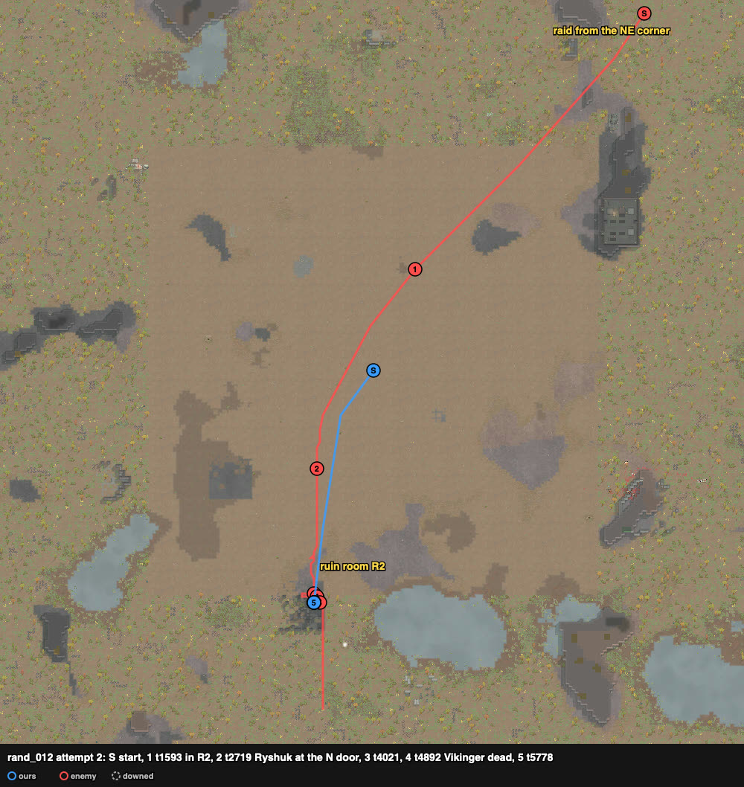
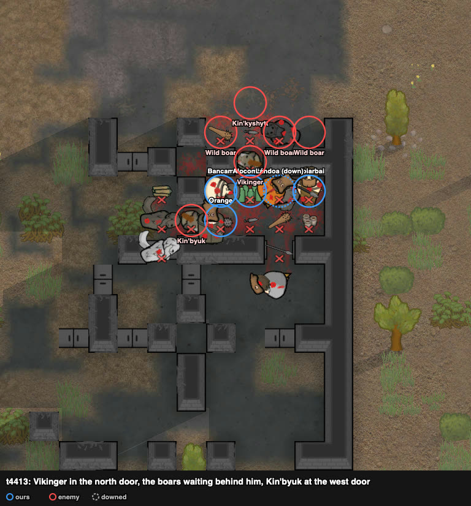

# rand_012 — Claude, 2026-10-05 (played alone) — Neanderthal melee ×5 vs Yttakin + 3 boars

Sheet: `sheets/rand_012_start.md`. Agent `amove`: squad down t2725, 2 dead, 3 downed, 0 kills,
badness 84.4.

## Card at the start
5 TribeRoughNeanderthal melee pawns: Irobiarbai steel ikwa (melee 13, Iron-willed), Bancam
wooden club (9, Bloodlust), Lándoa steel spear (7, the raid's target), Alocombar steel spear
(6), Orange steel spear (4). Raid (PirateYttakin, 370 pt) from the NE corner (214–219,
243–249), ~150 cells: Vikinger wooden club (melee 15, Brawler), Ryshuk steel knife (13/13,
Nimble), Ytten granite club (3/5), Kin'byuk steel knife (0/4), Kin'kyshytt bolt-action rifle
(shooting 4; "targeting go-juice"), three wild boars.

Site check: the west rock pocket is open to the north, and this raid comes from the NE, so it
would walk straight in instead of round rock B's tip (rand_126). The nook's wall can be hit
from two outside cells only (estimated ~1700 ticks for melee pawns). Chosen: open ground,
south-west of the start, with a long approach to string the raid out (rand_039's bounds).

## Attempt 1 — defeat

Trace `results/human/traces/rand_012_claude_20261005-132222.jsonl.gz` · row `results/human/play.jsonl` ·
result: **raid_left_with_captives** (t8958): Orange and Alocombar dead, Irobiarbai and Lándoa
kidnapped, Bancam downed, HP 487% · raiders: Ryshuk, Kin'byuk and a boar dead, Ytten downed ·
**badness 92.5**.

### Scenes
- **t0–1726**: walked to (93, 93). The raid strung out by speed. Measured towards us
  (cells/s): Ryshuk 5.8 and Kin'kyshytt 5.9 (go-juice), Kin'byuk 4.3, boars ~4.1, Ytten ~4.3,
  Vikinger 3.7. At t1726: Ryshuk 36 and Kin'kyshytt 38 cells away, the next group at 77–85,
  Vikinger 91.
- **t2102–2507** `raid-strung-out` → `gang-melee`: all five on Ryshuk. **Ryshuk dead t2507**
  (100 → 0 in ~400 ticks). Kin'kyshytt stopped at 15–18 cells and shot (Orange 82 → 45, Lándoa
  82).
- **t2507–2704**: a bound away (14 cells) barely started; Ytten led the next group by ~3
  cells.
- **t2779–3622**: all on Ytten (**down t3185**), then Kin'byuk (**dead t3622**), while the three
  boars and Vikinger (melee 15) arrived and joined in.
- **t3622–4790**: five raiders in contact with our five at 23–73%. **One boar dead**, Vikinger
  to 40%. **Irobiarbai down t3787, Bancam t4071, Lándoa t4461, Alocombar dead t4790**, Orange
  dead later.

### What the play stood on (observed)
- The first arrivals came alone and died alone (Ryshuk 5 v 1). The body of the raid (two
  humans and three boars at ~4.1–4.3 cells/s) arrived together, and Vikinger 30 s later.
- The rifle held at 15–18 cells for the whole fight.

## Attempt 2 — won (pyrrhic)

Trace `results/human/traces/rand_012_claude_20261005-132732.jsonl.gz` · row `results/human/play.jsonl` ·
result: **enemies_cleared, pyrrhic** (t6813): Bancam dead, Alocombar and Lándoa downed,
10 permanent, HP 391% · raiders: Ryshuk, Ytten, Kin'byuk, Vikinger dead; Kin'kyshytt (rifle)
and the boars left south · **badness 55.6** (agent 84.4).

Plan: ruin room R2 (sites.md; rand_115's site). Three one-cell doors, and only the pawns
touching a raider in a doorway fight. Cells: Irobiarbai (105, 47), Bancam (104, 47), Lándoa
(106, 47) on the north door; Orange (104, 46) on the west door; Alocombar (105, 46); rest cell
(107, 47).

### Scenes
- **t0–1593**: in R2. The raid strung out as in attempt 1: Ryshuk and Kin'kyshytt first (go-juice).
- **t2539–4021** `mouth-hold`: Ryshuk stood in the north doorway (105, 48) for ~1300 ticks
  against two or three of ours. Kin'kyshytt stood 2 cells behind him and shot in through
  the open door. Irobiarbai (29%) went to the rest cell at t3229 and Alocombar took his place.
  Ytten came to the west door (103, 46): **Ytten dead t3976, Ryshuk dead t4021.**
- **t3407–3800**: the three boars stopped ~30 cells north at (105–106, 76–77). They came to
  the north door only behind Vikinger.
- **t4051–4892**: Lándoa down t4051 (inside). Vikinger (melee 15) in the north doorway with the
  boars bunched behind him; Kin'byuk at the west door. **Kin'byuk dead t4712, Vikinger dead
  t4892**, both in the doorways.
  
- **t4892–5778**: with corpses lying in both doorways the boars came into the doors and the
  room. **Bancam dead t5042**, Alocombar down t5208.
- **t5778**: Kin'kyshytt and the last boar went south ("targeting cell (109, 0)"); raid gone t6813.

### What the play stood on (observed)
- The raid's humans came one per door and each was fought by two or three of ours. All four
  melee raiders died in a doorway.
- Ours were not kidnapped. The downed lay inside the room, away from the doors, while raiders
  were still fighting at them.
- Our losses came after the doors were held open by corpses and the boars got in.
