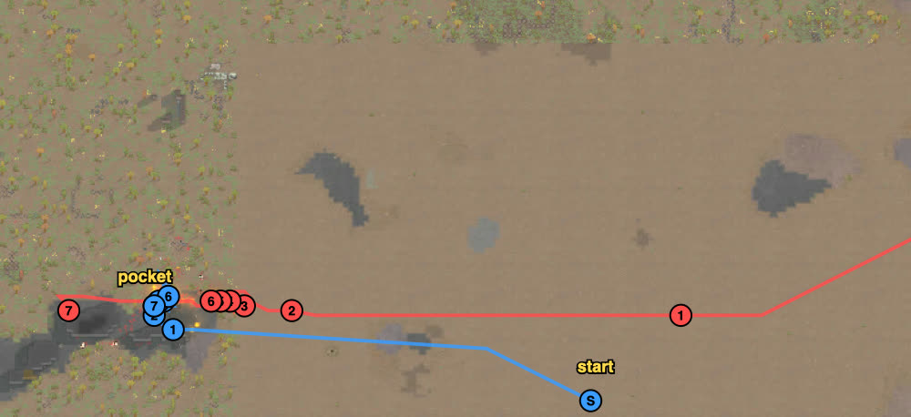

# rand_015 — Claude, 2026-10-05 (first problem played without the user)

Trace `results/human/traces/rand_015_claude_20261005-104313.jsonl.gz` · row `results/human/play.jsonl`
(player `claude`) · result: **defeat** (the raid left with Bilegoda), 1 dead (Manatee), 1
kidnapped (Bilegoda), 1 downed (Curne), 0 permanent, HP 461% · raiders: Tomb and Seizz dead
(one inferred), Tooth, Tasya, Horror left downed, 4 escaped · **badness 61.4** (51.4 without the
kidnap double count) vs the agent `doctrine` 105.2 (85.2).
Sheet: `sheets/rand_015_start.md` (rand_065 walled room, rand_084 west notch, rand_030 corner
ambush). Steps: `hands.guard(dt=3)` — but a `wait(3)` really advances 15–30 ticks (found after
the battle; the mod's wait speed), so the "3-tick" reflex ran at ~15–30.

## Card at the start
6 Neanderthals, five of them melee (Manatee 4/11, Crica 6/9, Mallard 3/7 with the only bow, a
greatbow), against 9 Waster gunners with a molotov thrower (Rubisum) and a tox grenadier
(Horror); every raider outranges us; 6 v 9. Raid from the north-east corner (243–249, 191–205).
Loadout: the normal ikwa to Manatee (melee 11), an ikwa for Crica's knife.
Site, from the map (not from sites.md): only rock (`%`) and walls (`#`) block sight; the
"rock hill" east of the start is bare ground on this arena. The candidates were the nook
(breach too slow: the raid would arrive first), the walled ruin by the NE ridge (next to the
raid's start), the big ruin (SSW) and the **west rock pocket**: between rock A (13–24, 139–145)
and rock B (27–40, 138–145), open to the north, a gap to the south-west at (23–26, 139). Seen
from the east, B hides the pocket; a raider has to round B's north tip (37–40, 145) and is then
4–6 cells from us. Plan: hide behind B's west face, take the raiders one by one as they round
the tip (corner ambush for melee), molotov thrower first.

## Scenes

### t210–2025 `raid-far` → `loadout`, walk
followed: all in the pocket by ~t1900 (Bilegoda, slower, at t2900). Every raider targeted Crica
and walked straight west along z 143 in a long column — into rock B's face.

### t2880–3376 `raid-strung-out` → `corner-ambush` `gang-melee`
saw: Seizz (machine pistol, melee 11) 13 cells ahead of the rest.
chose: wait until he rounded the tip (6 cells), then Manatee, Crica, Curne on him.
followed: **Seizz dead t3376** in ~150 ticks; ours 84–95%.

### t3376–4587 `raid-split` `melee-contact` → `melee-lock`
saw: Tasya (shotgun) and Horror (tox) rounding the tip, Dek and Tooth behind.
chose: Manatee + Crica lock Horror, Curne + Bilegoda on Tasya; then Manatee on Tooth when Tooth
flanked north to (38, 158) and shot into the melee.
followed: Horror never threw his tox; **Tasya down t4363, Horror down t4438, Tooth down
t4587** (Manatee + Crica). Four of nine out, none of ours down. But the fights had moved out
to the tip and north of it (36–40, 145–158), in view of Dek (shotgun, free at the tip) and the
three back gunners (Nicole, Davenport, Tomb) at 15–20 cells: Crica 87 → 37%, Curne 88 → 27%.

### t4587–5835 `raid-holds` `fire`
saw: Dek free at the tip, Rubisum (molotovs) arriving at (50, 143).
chose: Manatee + Bilegoda on Dek; Curne and Crica back into the pocket; Mallard out to (33, 149)
to see Rubisum.
followed: **Curne down t4857** (in the pocket's mouth). Five molotovs thrown, each target
sidestepped, but the fire spread on the grass and set Alpaca and Mallard burning — their
"wandering" was running about on fire (`extinguishing fire on …`), not disobedience. Dek broke
out of the melee. **Bilegoda down t5835** (56%, sent at Rubisum).

### t6097–8236 `kidnap` → `chase-carrier`
saw: "Wasters … have decided to kidnap who they can and leave" (t6097); Tomb went for Bilegoda.
chose: Manatee + Alpaca on Tomb, Mallard after him; Crica carried Curne away west.
followed: **Manatee dead t6494** (35% when sent; on his way to the carrier). Tomb dropped
Bilegoda to fight Alpaca; Davenport picked Bilegoda up and walked off the west edge (t8236);
Alpaca (burning, 35%) and Mallard (greatbow, shooting 3) did not stop him. Curne kept (carried).
Tomb died; Rubisum, Nicole, Dek, Davenport escaped.

## What the play stood on (observed)
- The pocket worked while the raid came round the tip one or two at a time: four raiders out,
  the tox grenadier locked before throwing, no loss.
- It stopped working when the fights drifted out to the tip and north of it: there the free
  shotgun (Dek) and three gunners at 15–20 cells, who never came round, shot the melee pawns.
  The melee squad had no way to reach gunners who held back.
- Molotov fire on grass reached pawns who had sidestepped the bottle.
- The kidnapping started with five of ours wounded or down; the carrier escaped past two
  wounded chasers.

## New tags / sites (for the user to look at)
- Site: **west rock pocket** (detailed cells above) added to sites.md; the "rock hill" entry
  corrected (bare ground on the open arena).
- Fact: a `wait(n)` advances by the mod's wait speed, ~15 ticks per step at the current
  setting (RIMMOLT_API).
