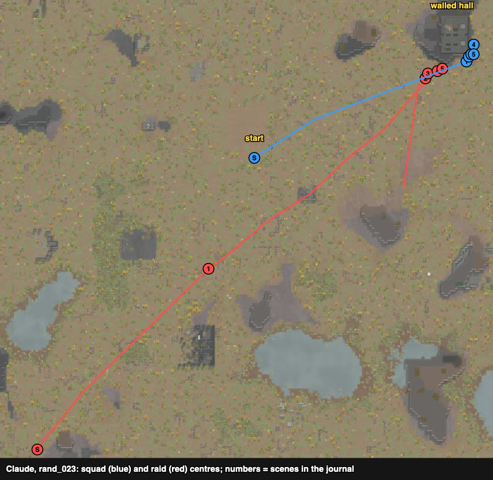

# rand_023 — Claude, 2026-10-05 (played alone)

Trace `results/human/traces/rand_023_claude_20261005-112931.jsonl.gz` · row `results/human/play.jsonl`
(player `claude`) · result: **squad down, defeat**: 4 dead, 6 downed, HP 805%; one raider out
(Toni, downed), six escaped · **badness 100.2** (agent `amove` 101.8). The start sheet was still
being written when the battle began; the site came from a terrain calculation instead.

## Card at the start
10 savage tribals, all melee, no armour (Whale 2/11 with the better spear after a swap with Ram,
the rest melee 0–6) against 8 outlanders without explosives: Lissa (revolver, shooting 19, flak
vest + jacket), Furr (autopistol, 11), five weak shooters (0–6), Toni (knife, melee 13). Raid from
the south-west corner, ~151 cells. All eight raiders targeted Hornet.
Reasoning from rand_015: the melee squad lost to gunners who held at range and shot into every
opening; so stand only on cells no outside cell can see. Terrain LOS (`rca.terrain`):
- big ruin: only 7–9 such cells (rooms R2 and R1's east end) — too few for ten;
- **north-east walled hall** (inside 203–213 × 168–182, no door, rock to the west): all 165
  inner cells hidden. With one wall cell broken, the cells still hidden from every outside cell
  within 35 depend on where: a mouth at the **south-east corner (213, 167)** keeps a block of 32
  hidden cells (203–211 × 168–172), 2–3 cells from the mouth — an entrant would step into the
  hall next to ten waiting melee pawns.

## Scenes

### t0–1650 `raid-far` → `loadout`, walk
Spear to Whale; ~95 cells to the hall's south-east corner, arrived ~t1650 (raid 130 cells away).

### t1650–4729 → `breach` (failed)
chose: three pawns (Whale, Colmea, Hornet) hitting the granite wall (213, 167) with the verb
gizmo, the order re-issued **every 45 ticks**, in a loop that **did not check the raid**.
followed: the wall went 95 → 93% in ~3000 ticks (re-issuing faster than a swing cancels it;
90-tick rounds worked in rand_127), and the raid walked up unseen: at t4729 it was 3 cells
away, Gorilla dead or down, Bustba, Salamander, Tiger down — the squad caught outside the wall
in the open, the gunners holding at 10–22 cells.

### t4970–5675 → `carry-downed`, hide behind the hall's east face
chose: carry the downed and move behind the hall's east face (hidden from the west by the hall).
followed: carrying under fire was slow; Ram and Hornet went down; one carry order picked up the
raider Toni (downed on the same cell as Tiger) instead of Tiger.

### t5976–6232 `melee-lock`
saw: Nytro (machine pistol, 0/0) came round the corner to 6 cells, Van (shotgun) behind him.
chose: Whale + Colmea on Nytro, then Colmea + Emñobi on Van.
followed: Van's shotgun downed Colmea; Emsea down. Whale and Emñobi fought on alone; squad
down at the end. The man in black came after squad down and was removed (fixed code).

## What the play stood on (observed)
- The hidden-cell idea was never tested: the breach failed (order cadence) and the raid caught
  the squad outside.
- In the open the raid's gunners again held at 10–22 cells while the melee squad was shot.

## Operating facts (to RIMMOLT_API / PROCEDURES)
- `Command_VerbTarget` on a building: one swing per order; re-issuing every 45 ticks cancelled
  the swings, every ~90 ticks works. Check the wall's % after the first rounds.
- Never advance time in a plain `wait()` loop: `hands.wait_safe()` / `hands.guard()` stop when
  a raider comes near or one of ours goes down.
- A "Carry X" float menu on a cell with two downed pawns may offer the other one first: check
  the option's label.
