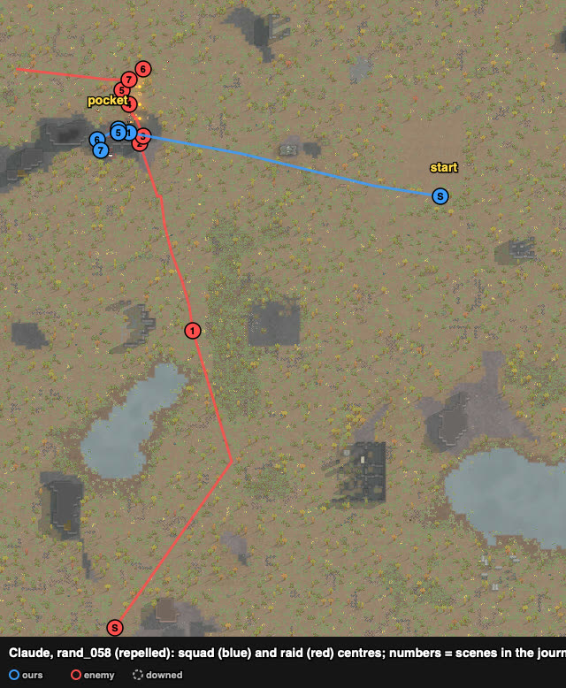

# rand_058 — Claude, 2026-10-05 (played alone) — repelled

Trace `results/human/traces/rand_058_claude_20261005-114731.jsonl.gz` · row `results/human/play.jsonl`
(player `claude`) · result: **repelled** (raid fled t4595), 2 dead (Pigork; Poinlaoik — **our own
frag**), 2 downed (Furr, Moinork), 1 permanent, HP 482% · raiders: 5 dead (Taali, Rocha, Cholaky,
Lorall, Fluona) + 1 inferred, 2 escaped · **badness 47.3** (agent `turtle` 99.1). The start sheet
(`sheets/rand_058_start.md`) was still being written during the battle.

## Card at the start
8 pig outlanders: five short guns already with the best shooters (Furr 10, Curly 8, Trev 7/10 in
flak, Poinlaoik 6, Paul 3 — the raiders' target), two molotov throwers and a frag thrower. Raid:
8 civil outlanders without explosives, three of them with shotguns, from the south-west corner.
Site: the **west rock pocket** again. LOS check against a raid from the south: the pocket's
west part is seen through the south-west gap; its east part (29–35 × 140–142) is hidden from the
south. The squad went there; Paul (the target) deepest at (35, 142).

## Scenes

### t0–1654 → walk (`wait_safe`)
In place by ~t1700; the raid came up the west side and approached from the south-east of the
pocket, so most of it took the short way round rock B's north tip.

### t2724–2814 `melee-contact` → `molotov-into-group` `melee-lock`
saw: five raiders bunched at the tip (37–42 × 143–146), Rocha 4 cells from Paul.
chose: frag on Sammy, molotovs on Fugly and Lorall, shotguns on Rocha, Trev to lock Rocha.
followed: **Taali dead t2754, Rocha dead t2814.** Bug: `guard()` took our own frag and molotov
for the raid's (this raid had no throwers) and sidestepped Trev *into* the raid — fixed (no
dodging when the raid has no throwers; a grenade first seen next to one of our throwers is ours).

### t2993–3113 `outflank` → `molotov-into-group` `melee-lock`
saw: Taffy, Sammy, Fugly went north to (33–39, 154–159) to look into the pocket (as in rand_015
and rand_126); Lorall (knife) on Moinork, who had walked out to the tip to throw.
chose: frag and molotov at the northern group (grass fire there, away from us), pistols on Sammy
and Taffy, Trev + Moinork on Lorall.
followed: **Cholaky and Lorall dead t3113**; Moinork down at the tip (carried in by Poinis).

### t3487–4387 `thrower-close`-like: a shotgun in the gap
saw: Fluona (shotgun) came up from the south and stood in the south-west gap (26, 139), 4–6 cells
from the pocket's west part.
chose: shotguns and Furr on him, a frag from Poinis, then three to lock him.
followed: Pigork died crossing the gap's view; Furr down. **My mistake:** I ordered Poinis's frag
at Fluona and then sent Poinlaoik, Curly and Poinis to melee him — the frag landed among them:
**Poinlaoik down (died), Curly hit** (combat log: "Poinlaoik was damaged by Poinis"). The lock
held (Fluona stopped shooting) but the two lockers (melee 1) kept missing until Trev (melee 10,
37%) joined: **Fluona dead t4387.**

### t4387–5811 `raid-breaking`
The four standing moved to the rock's south face (hidden from the north). **The raid fled
t4595**; Taffy and Fugly left, Sammy gone.

## What the play stood on (observed)
- The pocket again made the raid come to two corners: most of it to rock B's north tip in a
  bunch (good for frag and molotov), one shotgun up the south side to the gap.
- The raiders who went north of the pocket were answered with a frag, a molotov and pistols.
- Losses: a thrower who walked out to the tip to throw; a pawn crossing the gap's view; a frag
  of ours landing on our own lockers.
