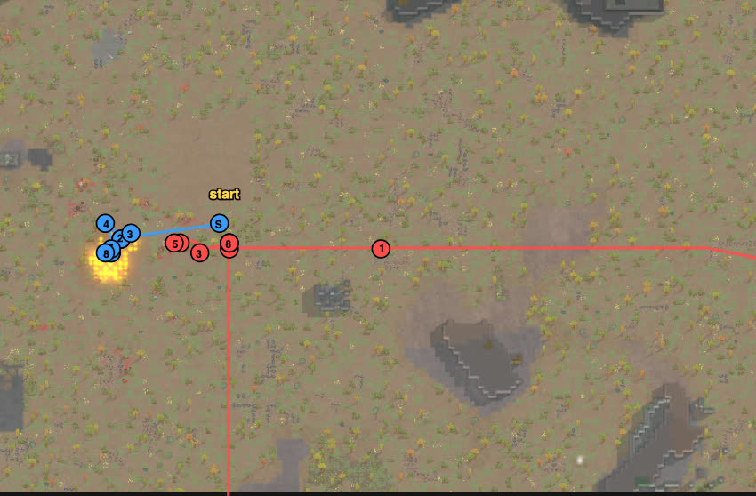

# rand_104 — Claude, 2026-10-05 (replay of the user's game)

Trace `results/human/traces/rand_104_claude_20261005-103418.jsonl.gz` · row `results/human/play.jsonl`
(player `claude`) · result: **repelled** (raid fled t4907), 1 dead (Goenaban), 3 downed (Cambiar,
Crica, Rrodoañocer), 0 permanent, HP 407%, raiders out 6 of 8 (Mac and Lady escaped) ·
**badness 35.3** (user 46.0, agent `turtle` 105.5). One run: the user warns that RimWorld's
results swing widely between runs (README, Variance).
First use of the rewritten `hands.guard()` (3–4-tick steps, the thrower's `targeting` names a
grenade's target, sidestep that keeps the range, errands resumed).

## Card at the start
The user's game: loadout (greatbow to Cambiar, rotation of three bows); one line at x 104,
z 105–137, Cambiar at (104, 123) — the cell from which the greatbow reaches the slate chunks
by the raid's path; Cambiar never moves (the pawns around take the molotovs); throwers first.
Added from the user's reading of their game: Bishop (shotgun) and Georgette (knife) are the top
threats; in the user's game both pressed the north half — so lock Bishop early.

## Scenes

### t60–1635 `raid-far` → `loadout` `skirmish-line`
followed: in place; at 38 cells all eight raiders targeted White; Rabbit (molotovs) in front,
headed for the cell (114, 119), 10 cells from White.

### t1786–2370 `approach` `thrower-close` → `frag-dodge`
chose: Cambiar on Rabbit once at 28 cells, then left alone.
followed: a molotov and two frags thrown at White, who sidestepped each (71% after the molotov);
**Rabbit downed t2370** (user: t2582), dead soon after.

### t2370–2919 `thrower-close` → `melee-lock`
saw: Bishop 12 cells from Cambiar and Crica; Cholaky 8–10 from Roamb and Donkey; Annie 12 from White.
chose: Crica (melee 12) to lock Bishop, Cheetah (Tough) to lock Cholaky, Cambiar on Annie;
Goenaban and Rrodoañocer on Bishop; Roamb pulled back (100 → 47% in one step, cause not in
the logs).
followed: four frags dodged (Donkey twice, Crica once — Crica's lock order came back after the
blast). **Annie dead t2919.** The raid pushed into our line: Cholaky ran through it towards
(95, 127).

### t3038–3807 `melee-lock`
chose: White joined Cheetah on Cholaky; Cambiar off the melee (friendly fire) onto Sammy;
Rrodoañocer and Goenaban sent at Georgette.
followed: Crica locked Bishop, but Georgette joined him: **Crica down t3425** (Georgette's
knife). Bishop, free, shot **Cambiar down t3732** (shotgun, pelvis and foot) — the greatbow
that never moved. Bows on Georgette: **dead t3792**. **Cholaky dead t3807** (White and Cheetah).

### t3734–3867 `no-enemy-melee` → `melee-lock`
chose: Goenaban, standing next to Bishop, locked him; Rrodoañocer joined.
followed: **Bishop dead t3867.** Five raiders dead, our losses so far two downed.

### t3867–4542 `raid-holds` → carry
saw: Sammy, Mac, Lady holding at 20–24 cells, shooting the nearest of ours.
chose: carry Crica back (Rrodoañocer), White and Roamb into range, Cheetah carries Cambiar.
followed: carrying in the forest under fire was slow (2–4 cells per 200 ticks): **Rrodoañocer
down t4409** (Lady's revolver) while carrying Crica; **Goenaban dead ~t4542** (Slowpoke,
wounded, walking back under the three guns).

### t4542–4917 → focus
chose: all bows on Sammy, nobody moving.
followed: **Sammy dead t4917; the raid fled t4907**. Mac and Lady walked off south.

## What the play stood on (observed)
- The throwers came first again and died early (all three by t3807; the user's game downed two
  by t2980 and the third at t6710).
- The early locks worked on the throwers (Cholaky) but not on Bishop: Georgette came to his aid
  and the lock broke when Crica went down; Bishop then downed the greatbow.
- After the melee phase, three gunners at 20–24 cells outshot our wounded while they walked
  or carried; standing still and focusing one gunner ended it.

## New tags / sites (for the user to look at)
None. `hands.guard()` in use: grenade targets read from the thrower's `targeting`, sidesteps,
and errands resumed (Crica's lock order came back after a dodge).
