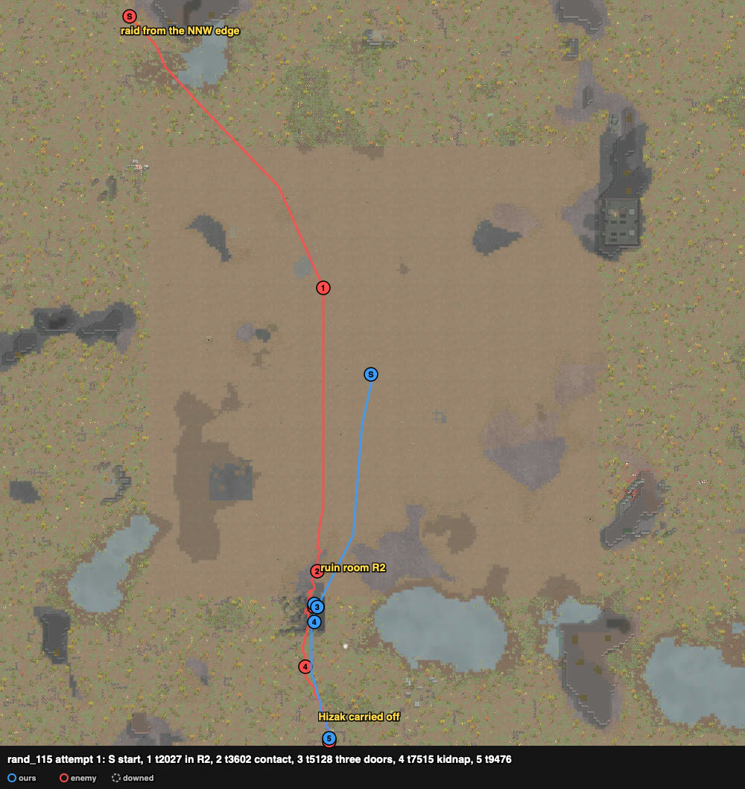
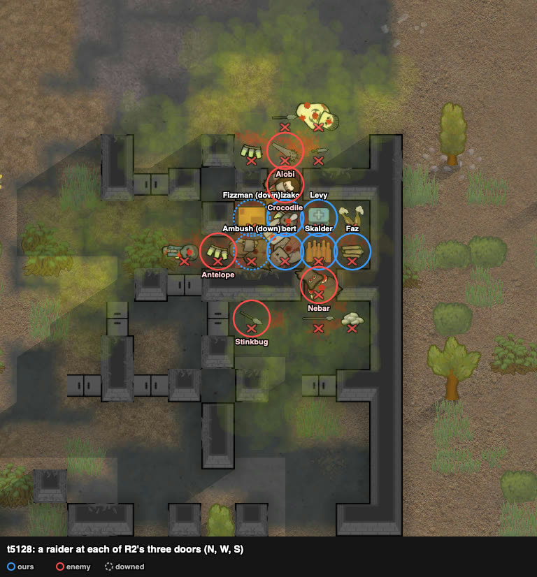
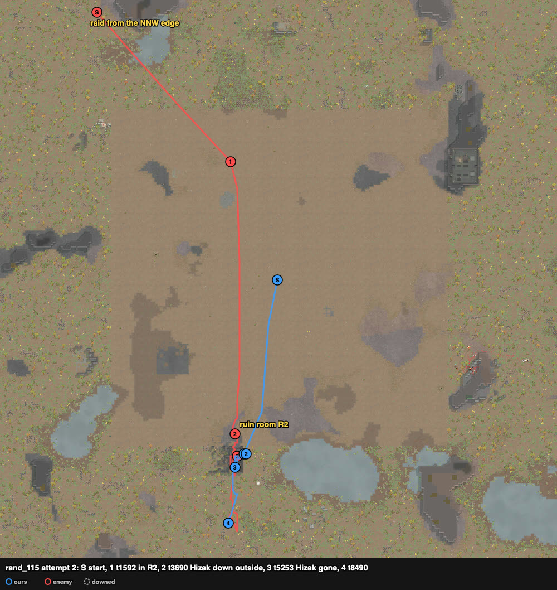
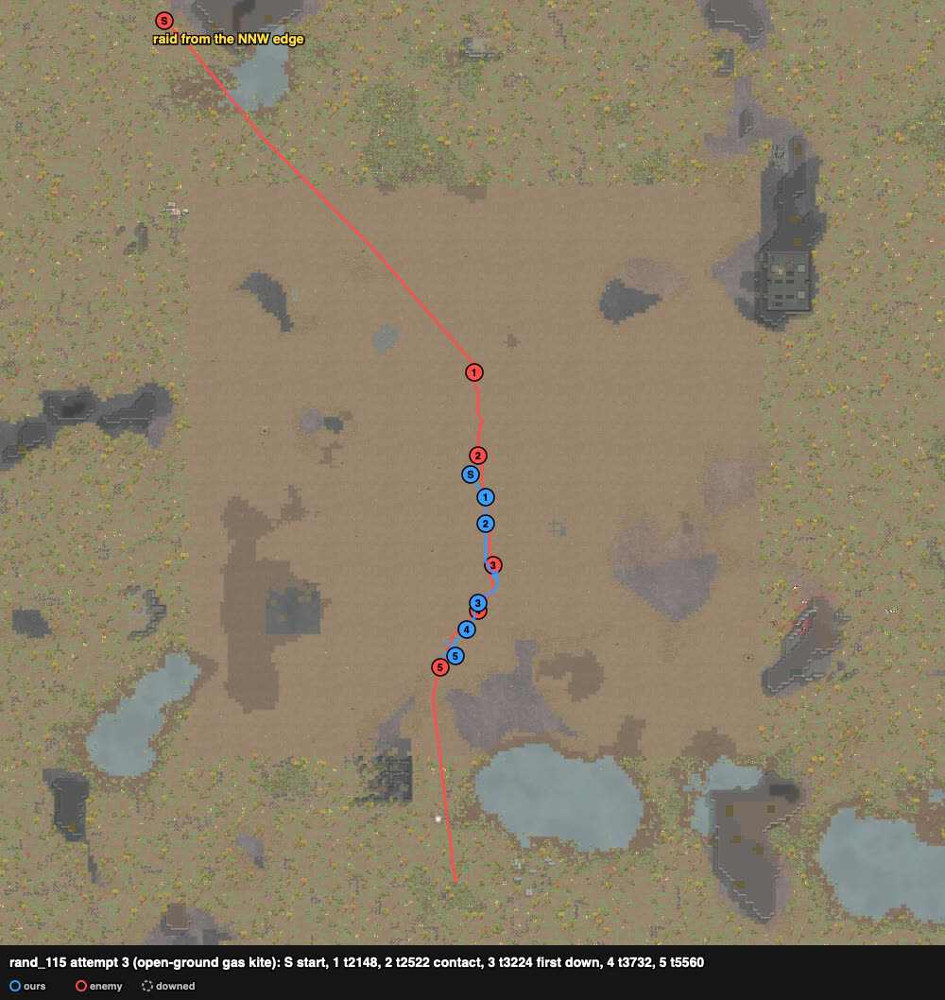

# rand_115 — Claude, 2026-10-05 (played alone) — tox throwers vs Neanderthal melee — not solved

Three attempts, all defeats: **80.8** (R2, one captive), 88.8 (R2, two captives), 146.9 (open
ground). Agent `kite` 84.8.

Sheet: `sheets/rand_115_start.md` (cards rand_127, rand_118, rand_015: the nook was its first site,
but it needs a breach). Agent `kite`: squad down t7796, 1 dead, 7 downed, 0 kills, badness 84.8.

## Attempt 1 — defeat (one captive)

Trace `results/human/traces/rand_115_claude_20261005-124516.jsonl.gz` · row `results/human/play.jsonl`
(player `claude`) · result: **raid_left_with_captives** (t9506): Albert dead, Hizak kidnapped,
3 downed (Ambush, Fizzman, Blurkap), 8 permanent, HP 396% · raiders: Jackal, Nebar, Antelope,
Crocodile dead, Alobi downed; Stinkbug left with Hizak · **badness 80.8** (70.8 without the
kidnap double count).

### Card at the start
8 PirateWaster pawns and **no guns**: seven tox grenades, Hizak (8/8) molotovs. Shooting/melee:
Fizzman 9/5 (Cirrhosis, moving 82%), Levy 3/6 (the raid's target), Ambush 2/4 (drill arm),
Faz 1/2, Blurkap 0/1, Skalder 0/0 (elbow blade), Albert 0/2 (elbow blade). Raid: 6
TribeRoughNeanderthal melee from the NNW edge (~145 cells): Antelope ikwa (melee 8), Crocodile
knife (6, Jogger), Alobi ikwa (5), Jackal granite club (5), Stinkbug marble club (2), Nebar spear
(1, berserker). No ranged weapons.

### Site choice
- The nook (the sheet's first pick) needs its wall broken. A pawn holding grenades has only the
  throw gizmo; with the grenades dropped it had no attack order at all, and "Go here" was the only
  option on the wall. So no breach.
- A map scan for cells whose removal cuts off a pocket of 6–120 cells (articulation points,
  no corner cutting) found none on this map.
- Chosen: **ruin room R2** (inside 104–107 × 46–47, 8 cells) with three one-cell doors: north
  (105, 48), west (103, 46), and the inner door (106, 45) from R1. The room is ~82 cells south of
  the start; we were all in at t2027 with the raid ~100 cells away.

### Tool findings before contact (t75–421, t3257–3467)
- A tox throw ordered at a cell (`targetX/targetZ`) or at one of our own pawns came back
  `executed` and nothing was thrown.
- A throw ordered at a raider through the verb gizmo (`attack`) also came back `executed` with
  no throw (Fizzman and Hizak stood outside the north door for it).
- The float menu's "Fire at <name>" throws (`hands.fire`). It is enabled only with line of
  sight: from inside, a raider is visible only through an open door.

### t3467–3602 contact; my mistake
The raid came straight down x 108 at Levy: Crocodile first, then four together, Alobi ~24 cells
behind. My first controller sent everyone within 6 cells of a raider into melee, so pawns walked
**out of the room** after Crocodile and Stinkbug. At t3602 I pulled them back. Redrafting was
needed for pawns already on their cells, since an order to stand where they were was refused.

### t3647–5128 tox works; three doors held
From then on: melee only on a raider in a doorway or inside; one throw per free pawn per step.
- Tox thrown at the raider in a doorway filled the closed room. **Every raider got "Tox gas
  (severe)" and a toxic buildup** (~0.05 per 150 ticks while in the gas). At t5128 their
  consciousness was 63–77% and moving 49–68%.
- **Our Wasters showed no tox hediff at all, except Albert:** buildup 0.08 at t4155, rising to
  0.73, with consciousness down to 72%.
- Crocodile, Jackal and Alobi came to the north door; Antelope and Stinkbug to the west door;
  Nebar and Stinkbug round through R1 to the inner south door.
- **Ambush down t4739** (west door, Antelope, melee 8; he was being rotated out),
  **Jackal dead t4858**, **Fizzman down t5128** (west door).

### t5128–7274 the gas wins the room
- **Hizak down t5475; Nebar dead t5504; Crocodile down t5713** (buildup 0.73; he died of it at
  t7515).
- **Albert dead t5744** (buildup 0.73, in melee at the inner door). His log was gone with him.
- **Blurkap down t6974** (Antelope, inside the room by then); **Antelope dead t7020** (0.80);
  **Alobi down t7274** (0.79).
- Levy, Skalder and Faz stayed at 100% the whole fight.

### t7020–9506 the kidnap
Stinkbug (100% health, buildup 0.79) had left the west door. He came back for Hizak and
carried him south. My room controller only answered raiders at the doors, so it did not react.
I saw it at t7515, with Stinkbug at (102, 26).
- Levy, Skalder and Faz chased and caught him at the south edge (t8461, z 7).
- Three melee 0–6 pawns took him 100 → 36% in ~1000 ticks. **He walked off the map at
  t9506 with Hizak.**
- No tox was thrown at him during the chase.

### What the play stood on (observed)
- The closed room kept the gas thick and the raiders came into it through the doors. Five of six
  went down or died, three of them with buildup ~0.73–0.80.
- Our losses came from melee at the doors (Antelope, melee 8, took two) and from the one
  non-immune pawn. The kidnapper was the raider who had stood least in the gas.

## Attempt 2 — defeat (two captives)

Trace `results/human/traces/rand_115_claude_20261005-130226.jsonl.gz` · row `results/human/play.jsonl` ·
result: **raid_left_with_captives** (t8490): Hizak and Fizzman kidnapped, 0 dead, 3 downed,
7 permanent, HP 394% · raiders: Antelope, Jackal, Nebar and Alobi dead (corpses on the map);
Crocodile and Stinkbug left with captives · **badness 88.8**. The row says 0 killed and 5
escaped: the tracker counts a raider whose last job was "kidnapping", or who died of tox
without a kill line in a log, as escaped.

Changes from attempt 1: Albert (not immune) kept ~30 cells east of the ruin; throws through
"Fire at" from the start; Fizzman and Hizak threw from the north door at the approaching raid;
kidnap watch and a rest cell in the controller.

### Scenes
- **t1592** all in R2 (Albert at (136, 44)). The raid came down x 106–108 again, Crocodile first.
- **t3245–3381**: Fizzman and Hizak threw two tox grenades and two molotovs at Crocodile from
  the north door (12 → 6 cells), then stepped back. **Hizak was caught outside: down at t3690
  at (105, 49), "cannot crawl".** Five raiders stood round him "melee attacking Hizak".
- **t3719–4021**: Fizzman held the north door open, and everyone inside threw at the bunch
  every ~90 ticks. Tox gas (severe) on Nebar, Antelope, Crocodile. **Stinkbug picked Hizak up
  meanwhile** (t~4000) and carried him south along x 102–109. Fizzman down t4051 in the door.
- **t4051–5253**: Albert, sent to follow the carrier, walked to a point beside where Stinkbug
  *had been* and never got in range. **Stinkbug left the map with Hizak at t5253**, never hit.
  Ambush down t4711, Levy down t4967 (west door, Jackal inside the room by then).
- **t5027–8490 four kidnappings at once**: Antelope (36%) took Ambush at the north door and
  was killed there (t5165). Then Alobi took Levy, Crocodile took Fizzman, Nebar took Ambush.
  Blurkap and Faz stood in the room on throw orders at Crocodile, whom they could not see,
  while Nebar walked past them; with melee orders instead, Nebar died t6456 and Alobi t8490.
  **Crocodile left with Fizzman.**

### What the play stood on (observed)
- The tribal Neanderthals kidnapped **during** the fight, as soon as one of ours lay downed
  near a door, and also carried downed pawns out of the room through the doors.
- Three of ours with fists (melee 0–2) needed ~1000–2000 ticks to kill a carrier.
- A throw order on a raider that later went out of sight left the pawn standing with
  "attacking <name>" and doing nothing (Blurkap, Faz: same as the bows in rand_118).
- Gassed raiders moved at about half speed (attempt 1: moving 49–68% at t5128).

## Attempt 3 — defeat (open-ground gas kite)

Trace `results/human/traces/rand_115_claude_20261005-131140.jsonl.gz` · row `results/human/play.jsonl` ·
result: **raid_left_with_captives** (t9503): Ambush, Blurkap and Albert dead; Levy, Hizak and
Faz kidnapped; 2 downed; HP 723% · raiders: none lost · **badness 146.9**.

The idea: in attempt 1 the gassed raiders moved at about half speed, so throw tox at the
chasers and step away on open ground, and leave no one downed for kidnappers.

### Scenes
- **t0–2148**: the group formed at (128, 118); the raid came from the north (x 125–128) and
  switched its target to Hizak and Faz, the nearest.
- **t2239–2522**: the first throw orders came at 10 cells (Crocodile, Jogger, ungassed). The
  rule "step back 12 when a raider is within 7" fired on the next step and cancelled them.
  Crocodile kept pace and was next to us by t2522.
- **t2552–3224**: with a 3.5-cell trigger, then alternating throw/step phases, the group
  stepped back every ~30–60 ticks with Crocodile 1–3 cells behind and the others 4–8. Few throws
  finished. **Skalder down t3224, Fizzman t3329.**
- **t3224–3643**, standing and throwing point-blank: buildup stayed at 0.05–0.07 on two raiders
  and 0 on the rest. "Tox gas (mild/moderate)" took them to 89–97% consciousness, 84–94% moving.
  All six raiders were at 100% health.
- **t3643–5560**: the six mobbed one pawn at a time: **Ambush dead t3732**, Faz down t4256,
  Hizak t5154, Levy t5259, **Blurkap dead t5560**. Albert, sent away east, died later.

### What the play stood on (observed)
- In the open the tox gas thinned out. Buildup rose ~0.01 in 600 ticks, against ~0.05 per
  150 ticks in the closed room.
- Ungassed Neanderthals (Crocodile, Jogger) kept up with our group (Fizzman 82%, Ambush 92%
  moving), so stepping away gave them free hits and stopped our throws.
- Six raiders together picked off one pawn at a time, as in the human's open-ground rand_127
  attempt.

## Across the three attempts (observed)
- Room R2 + tox: five of six raiders dead or down in attempt 1, four dead in attempt 2. The
  losses were downed pawns kidnapped during the fight, through the doors.
- Open ground + tox: no raider lost.
