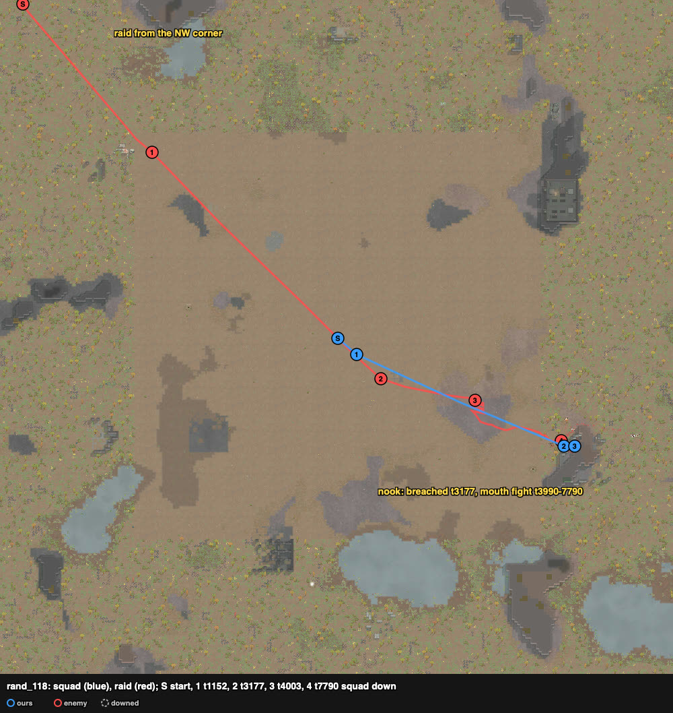
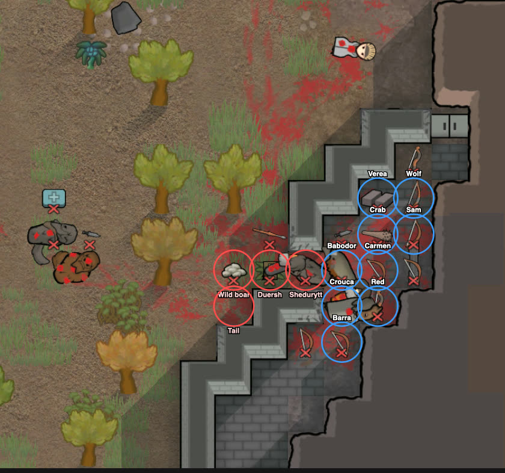
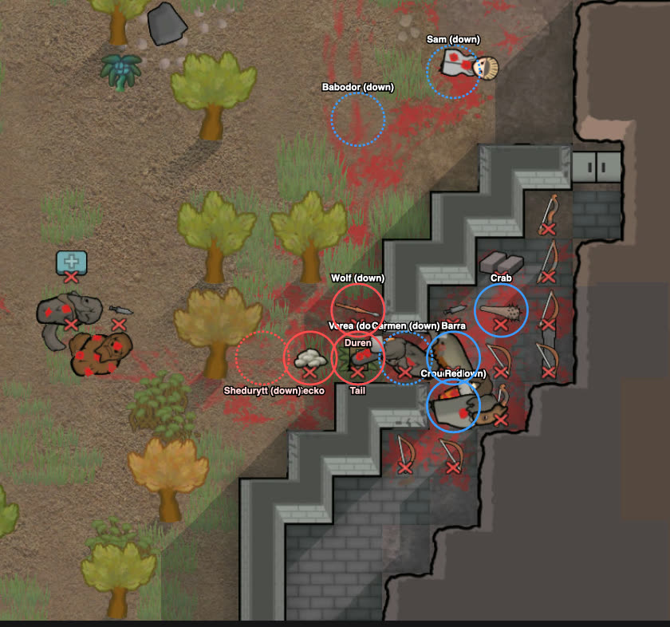
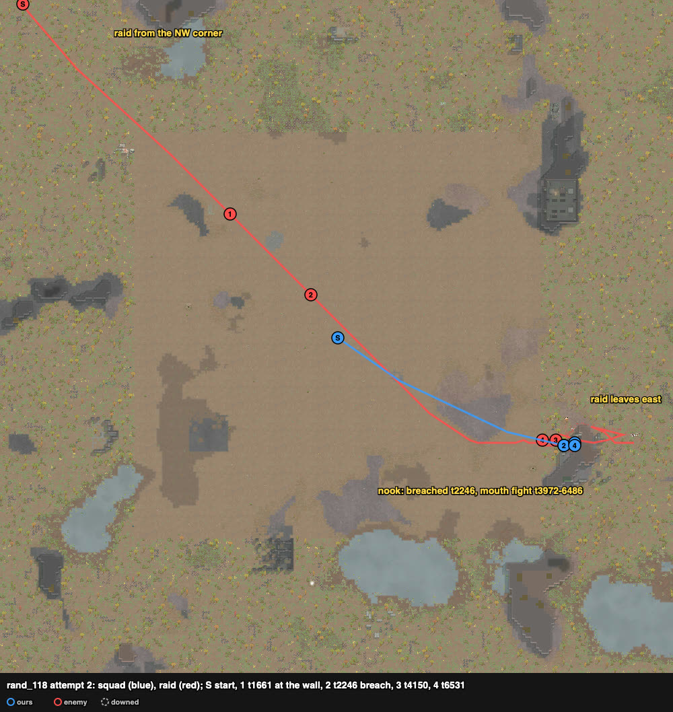
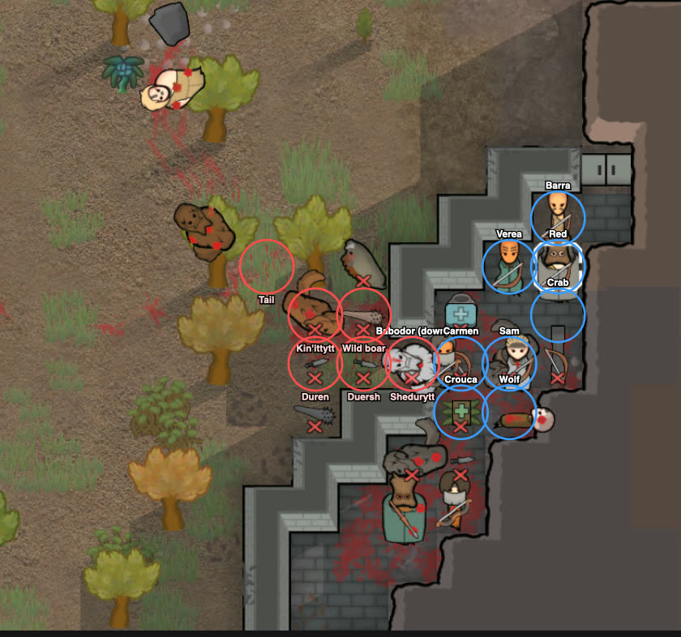

# rand_118 — Claude, 2026-10-05 (played alone) — tribal bows vs Yttakin blades + boar — repelled

Counted play: **attempt 2**, trace `results/human/traces/rand_118_claude_20261005-123236.jsonl.gz` ·
row `results/human/play.jsonl` (player `claude`) · result: **repelled** (enemies_cleared t7954),
**0 lost**, 2 downed (Wolf, Babodor), 6 permanent, HP 256% · raiders: Klomster, Duersh, Duren,
Kin'ittytt and the boar dead, Shedurytt downed; Tail and Gecko left east · **badness 28.2**
(agent `kite` 93.2: squad down t4600, 1 killed; old rule, the row stopped at squad down).
Sheet: `sheets/rand_118_start.md` (cards rand_067, rand_127, rand_039; rand_127's nook was used).

## Attempt 1 — discarded (a context compaction came during the battle)

Trace `results/human/traces/rand_118_claude_20261005-121051_try1.jsonl.gz` · row moved to
`results/human/discarded.jsonl`. The compaction came at t6245; I resumed instead of replaying,
so the row does not count. What the trace and the combat logs show:
**all nine down at t7790**, then the raid left with Wolf, Verea and Carmen (row: 3 kidnapped,
6 downed, 1 permanent, HP 680%; badness 117.2, 87.2 without the kidnap double count).
Raiders: Klomster, Duersh and the boar dead, Shedurytt downed; Tail (20%) collapsed at the east
edge while carrying Barra, who was left on the map; Gecko, Kin'ittytt and Duren escaped.

### Card at the start
9 TribeRough bows, no armour: after the loadout Sam 11 greatbow, Crouca 9/14 and Crab 7/4
recurve, Wolf 7 short bow (Trigger-happy, the raid's target), Babodor 4/11, Red 4/1, Barra,
Verea short bows, Carmen 3/8 pila. Raid: 8 PirateYttakin from the NW corner (~170 cells):
knives Duersh, Klomster, Duren (9/8), clubs Kin'ittytt (6/5) and Shedurytt (9/6), **Tail
(machine pistol, 4/1)**, **Gecko (autopistol, 1/6, Brawler)** and a wild boar. Speeds 3.8–4.2
cells/s against our 3.75, so a kite would not last. Plan: rand_127's nook (mouth hold).

### Scenes
- **t0–2291** `loadout` → walk ESE ~95 cells to the nook's wall. Kin'ittytt and Duren dropped
  to 54% and 52% at (45, 199) far behind the raid and stood there ~1100 ticks (cause not seen).
- **t2291–3177** `breach`: 9 pawns, one swing per order, a round every 90 ticks: the marble
  wall at (211, 84) broke in 6 rounds. The raid's front was ~45 cells away; all inside by t3328
  (front Babodor (212, 84) and Crouca (212, 83); Sam at (214, 85)).
- **t3553–4003** `raid-strung-out`: the raid came along z 84–85 straight at the mouth (as the
  sheet predicted from its line to Wolf); the bows shot down the lane: **Klomster dead ~t3990**.
  Gecko stopped at (189, 85), ~22 cells out, until ~t4900.
- **t4003–5735** `mouth-hold`: Shedurytt (club) stood in the mouth for ~1650 ticks (91 → 18%)
  against Babodor and Crouca; **Tail stood 1–2 cells behind him at (209, 83–84) and shot in.**
  Sam (greatbow) down t4317 (Tail), Babodor t4809 (Duersh's knife), Crouca t4832 (Tail);
  **Duersh dead ~t4820**; the boar got inside to (212, 84) and **died ~t5200**; Verea down t5345,
  Wolf t5735.
  
- **t5660–7008**: Carmen (pila, melee 8) in the mouth against Tail and then Duren too; down t7008.
- **t7008–7790**: Red, Barra and Crab shot out through the mouth at Tail (2 cells) while Tail and
  Gecko shot in: Barra down t7363 (Gecko), Crab ~t7371, Red t7790 (Tail). Tail 31 → 20%.
  The verb gizmo order ("Command_VerbTarget") came back executed but left the bows "watching
  for targets"; the float menu's "Fire at <name>" made them shoot (`hands.fire`).
  

### What the play stood on (observed)
- Of the six downed whose logs could be read after the battle, four were downed by Tail's
  machine pistol and one by Gecko's autopistol, all fired through the mouth; one by a knife.
- The mouth held the melee raiders one at a time as in rand_127, but the two pistols stood
  behind the raider in the mouth and shot the pawns lined up inside it.
- The raid did not flee with Klomster, Duersh, the boar and Shedurytt out (~t5700).

## Attempt 2 — counted

Same card, same plan (the nook), with two changes from attempt 1: no wait for the retrieval
subagent before walking (the sheet was already written), and fire control through the float
menu's "Fire at" with a shot-count check (scratch script `mouth2.py`; `hands.fire`).

### t0–2246 `loadout` → walk, `breach`
Greatbow Red → Sam (t75). At the wall t1661 (attempt 1: t2605). Nine pawns, one swing per order,
a round every 90 ticks: **open at t2246** in 6 rounds (91 → 88 → 68 → 32 → 26 → 3 → broken). The
raid was ~100 cells away and walking as one group (attempt 1: Kin'ittytt and Duren fell behind).

### t2246–3972 inside; the raid down the lane `raid-strung-out`
Front cells inside: only two touch the mouth — (212, 83) and (212, 84); **(212, 85) is still the
urn** and (214, 84) holds a column. Crouca (212, 83), Babodor (212, 84); bows behind at
(213, 83–86), (214, 85–87); Sam (greatbow) at (213, 84), the only row that sees far down the lane
(Bresenham check: (212–214, 84) see (189–205, 85); the south pocket (209–212, 78–82) sees none of
the lane). The raid came along z 84–85 at Wolf; Tail was "targeting cell (196, 85)", then came
on with the melee; Gecko held at ~20–22 cells (191, 84) the whole fight.

### t3972–4150 → `mouth-hold`
saw: Klomster, Shedurytt, the boar, Duersh, Duren and Kin'ittytt queued outside the mouth.
**Babodor stepped into the mouth cell (211, 84) itself** and was hit from several sides: down at
t4150 (Tail's machine pistol). Carmen took his inside cell.

### t4150–4537: bows on Tail did not shoot
saw: Sam and Wolf were ordered at Tail first; their jobs read "attacking Tail" for ~1000 ticks
while their shot counts did not move (Sam: 1 shot by t4537); the bows on the raider in the mouth
were firing. chose: order the bows at the raider in the mouth first (point-blank), Tail and
Gecko after, and re-pick any bow whose shot count stalls for 3 steps.

### t4433–6486 the queue dies one at a time `rotation`
**Klomster dead t4433, Shedurytt down t4823, Duersh dead t5137, the boar dead t5513, Duren dead
t6066, Kin'ittytt dead t6486**, each in the mouth cell with two front pawns and six bows on it.
Rotations: Carmen (38%) out at t4868 → Barra in; Crouca (41%) out at t6126 → Crab in; the
wounded rested in the south pocket (211–212, 81). **Wolf (the raid's target, bow at (213, 83))
down t6171** to Tail's machine pistol, fired from 2–4 cells outside the mouth.

### t6486–7954 `raid-breaking`
With five dead and one down, Tail (88%, never hit hard) and Gecko turned for the east edge
("targeting cell (249, 84)"); nobody of ours went out. Babodor had crawled out to (207, 88) and
was not taken. Raid gone t7954.

### What the play stood on (observed)
- The mouth again took the melee raiders one at a time; the six melee pieces died or went down
  in the mouth cell over ~2500 ticks with two of ours touching it and the bows shooting it.
- Both of our downed were shot by Tail's machine pistol (Babodor standing in the mouth cell,
  Wolf at (213, 83)); Tail stayed at 88% all fight and left.
- Shots per pawn: Crab 17, Verea 17, Wolf 16, Red 16, Crouca 10, Barra 8, Babodor 5, Sam 4,
  Carmen 3. Damage dealt: Crouca 182 (melee 14 at the front), Verea 175, Crab 151.
- Attempt 1 vs 2 on the same site: in attempt 1 the bows sat at the least-visible cells and the
  pistols outlasted the front; in attempt 2 the bows shot the mouth raider and the queue died
  before the front ran out (two rotations used).

## New tags / sites (for the user to look at)
- sites.md, nook: the urn at (212, 85) was left standing in both attempts, so two cells touched
  the mouth from inside (Claude's rand_127 broke it for three); a column at (214, 84); the south pocket (209–212, 78–82) is out
  of the lane's sight and served as the rest spot.
