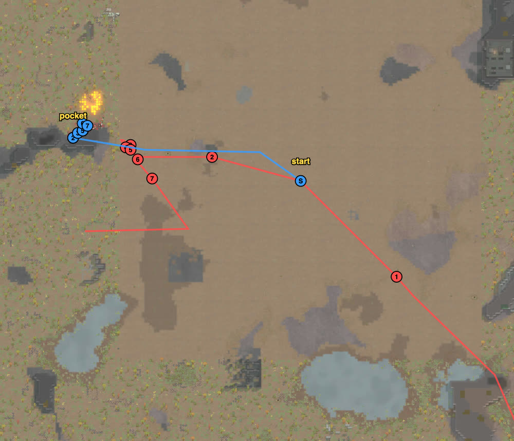

# rand_126 — Claude, 2026-10-05 (played alone) — won

Trace `results/human/traces/rand_126_claude_20261005-113851.jsonl.gz` · row `results/human/play.jsonl`
(player `claude`) · result: **repelled** (raid fled t6098), **0 dead, 0 downed**, 1 permanent,
HP 290% · raiders: 6 dead (Wes, Diana, Nadezhda, Oahnip, Storch, Smarty), 2 escaped ·
**badness 13.6** (agent `close` 99.8). Sheet: `sheets/rand_126_start.md` (written during the
battle; the site came from the rand_015 journal and a terrain check).

## Card at the start
10 Waster pirates, mostly melee, with one excellent shooter holding a club (Max 16) and a rifle
in a shooting-4 hand: loadout **rifle → Max**, machine pistol → Whisper (9), tox grenades → JC
(1). Dtchrath has **Fire spew**. Sara (0/11, Brawler) is the raiders' target. Raid: 8 pirates
without explosives from the south-east corner; Nadezhda (rifle 10), Storch (revolver 13), Oahnip
(club, 13/14). 10 v 8.
Site: the **west rock pocket** (rand_015's). LOS check first: the pocket is hidden from every
south, south-east and east spot; only the north sees in. Groups: Sara, Dtchrath, Choke, Celanial
behind rock B's west face (the tip ambush); Rokman, Hodge by the south-west gap; Max, Whisper,
Heskez, JC inside the pocket. Raider to answer: the gunners who hold north of the pocket (as
Tooth did in rand_015) — Max's rifle, the machine pistols, Fire spew and tox for them.

## Scenes

### t91–2114 → `loadout`, walk (with `wait_safe`)
In place by t2114, raid 127 cells away. It came round to the east of the pocket and walked west
along z 143–146 at Sara, as in rand_015.

### t4142–4546 `raid-strung-out` → `corner-ambush` `gang-melee`
Wes (machine pistol) rounded B's north tip first: Sara, Dtchrath, Choke on him (+ Max).
Oahnip (club, melee 14) joined on Choke; the gap pair and Celanial came up: **Wes dead t4546**.

### t4381–5089 `outflank` `raid-holds` → focus, `ability`
saw: Storch, Fudiao and Nadezhda went north to (37–39, 153–159) — the spot that sees into the
pocket — and shot the tip fight; Diana (rifle, melee 9) stood at the tip.
chose: four on Oahnip, Sara + Rokman lock Diana; Max on Nadezhda, Whisper on Fudiao, Heskez on
Storch; JC up to (32, 149) to throw tox at the northern three (no gas cloud seen).
followed: **Diana dead t5029, Nadezhda dead t5089** (the northern group's rifle), **Oahnip dead
t5285** (4 on 1, slow with weak clubs).

### t5285–5699 `no-enemy-melee`-ish → `ability` `melee-lock`
chose: Dtchrath walked to 7 cells of Storch and Fudiao (standing together) and Fire-spewed the
cell between them; Hodge and Choke on Storch, Celanial on Fudiao.
followed: Storch 87 → 40% and Fudiao set burning (running about); **Storch dead t5699** (Hodge).

### t5699–6225 `raid-breaking`
Smarty (knife) held by Sara + Rokman: **dead t6106**; **the raid fled t6098** with five dead.
Fudiao ran; Muscoquart (far behind all game) never arrived.

## What the play stood on (observed)
- The pocket's cover from the east and south-east: raiders could only see in from the north
  tip (close) or from the north (10–16 cells).
- The holders at the north were answered at range this time: a shooting-16 rifle, two machine
  pistols, and a Fire spew on two raiders standing together.
- 10 v 8 and 3–4 of ours on each raider at the tip; nobody of ours went down (lowest 45–51%).
- The raid walked straight at its target (Sara) from the east along z 143–146, the same lane as
  rand_015's.
