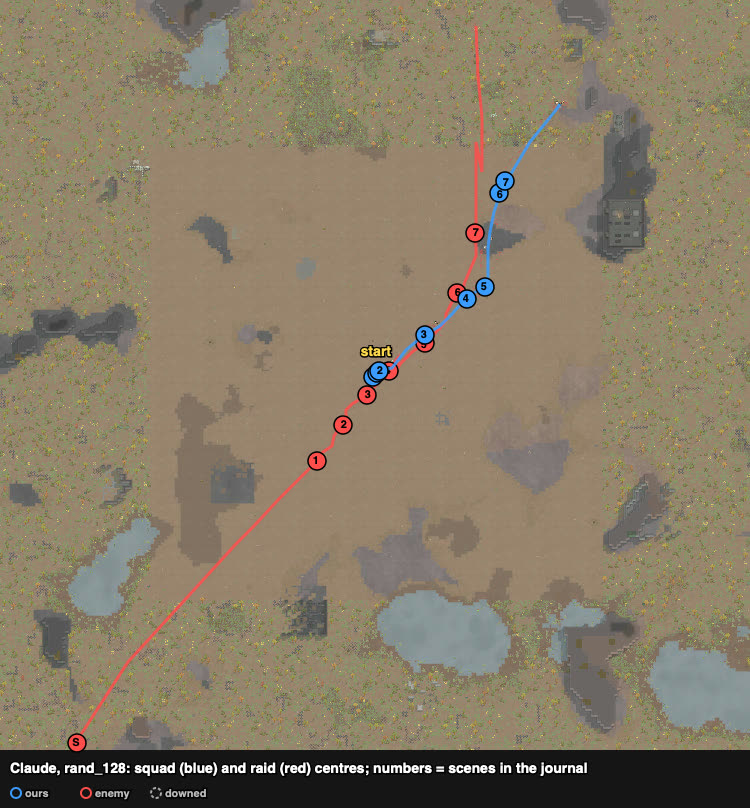

# rand_128 — Claude, 2026-10-05 (played alone) — Empire champions

Trace `results/human/traces/rand_128_claude_20261005-115619.jsonl.gz` · row `results/human/play.jsonl`
(player `claude`) · result: **defeat** (the raid left with Squiggle), 4 dead (Poikup, Moinag, Piggy,
Chef), 1 kidnapped, HP 617% · raiders: **both champions dead** (Lekapenos, Theodore), the LMG
trooper and the janissary left · **badness 94.7** (84.7 without the kidnap double count; agent
`turtle` 95.4). Sheet: `sheets/rand_128_start.md` (no case in the library had shield belts,
plate armour or champions).

## Card at the start
8 pig outlanders (pistols, shotguns, a frag and a molotov thrower; loadout: Chef 9 ← Dennis's
autopistol, Piggy 4 ← Moinag's shotgun) against 4 Empire: champions Theodore (Zeushammer, melee 16)
and Lekapenos (spear, melee 19), both in steel plate with shield belts; Arebo (LMG, shooting 14,
flak) and Puspabas (charge rifle, 7, recon). Lekapenos and Puspabas carried go-juice and took it
("targeting go-juice"). Site: none near the start; the fight was on the open ground.

## Measured speeds (cells per second, drafted walk / raid walk)
Theodore 3.1 (plate) · Arebo 3.6 · Lekapenos 4.2 (on go-juice) · Puspabas 5.6 (go-juice, Jogger) ·
our Joshua 3.75. So Theodore could be out-walked, Lekapenos and Puspabas not.

## Scenes

### t929–1919 `approach` `raid-strung-out`
The raid strung out by speed: Puspabas first — he **stopped at ~22 cells and shot** (charge rifle)
instead of closing; Lekapenos ran in at Squiggle.

### t1919–2505 → focus on Lekapenos, molotov, frag
All guns on Lekapenos from 17 cells; frag (Dennis) and molotov (Squap) at 11. Her log: early
bullets "hit uselessly" (shield / plate), then kidney, torso and molotov burns went through:
100 → 60%. She reached the group and fought in melee (Poikup, Moinag); Theodore came on; the
gunners held at 22 cells and wore us down.

### t2505–3842 → `stepped-withdrawal`
Bounds of ~15 cells north-east: the two gunners did not follow (they held), Theodore fell behind;
Lekapenos kept up. Poikup, locked in melee when the bound started, was left and died. Lekapenos
(on go-juice: moving 121%, breathing 47%) sat at 25% while bullets missed or ricocheted, then
died at t3842 — with Moinag at the same moment.

### t3932–5667 → kite the slow champion (`kite` loop)
Theodore alone and slower than us: shoot until he is 6 cells away, step 12 cells back, repeat
(`journals/rand_128_kite_loop.py`, six cycles); molotov + frag on him in the first two cycles.
87 → 38% in the first cycle, **dead at t5667**. Squiggle (49%, the slowest) fell behind and
went down.

### t5667–10032 the gunners
saw: Arebo (LMG, shooting 14) and Puspabas holding together at ~21–25 cells.
mistakes: Piggy sent to carry the downed Squiggle into their view — killed; the group waited at
~21 cells in the LMG's view for the kidnapper — Chef killed. Arebo carried Squiggle off.

## What the play stood on (observed)
- Shield belt + plate: bullets first "useless", then through; a molotov burned Lekapenos; a
  frag + molotov + shots took Theodore 87 → 38% in one cycle.
- Speed decided the champion fights: the slower one was kited down without loss; the faster
  one (go-juice) had to be fought in contact.
- Every loss after the champions came from the two gunners who held at 21–25 cells on open
  ground (no rock or walls near).
