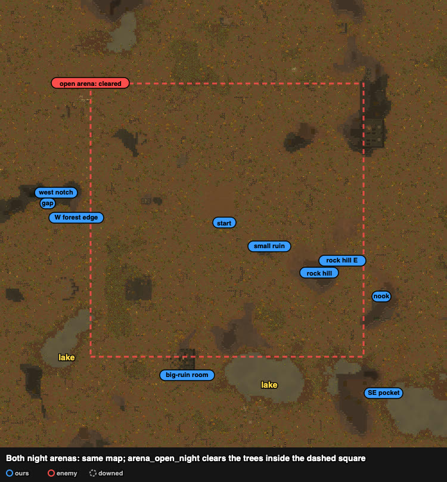

# Sites on the night arenas

Both night arenas are one map: `arena_open_night` is `arena_forest_night` with the trees cleared
inside x 50–203, z 50–203 (the dashed square). Rock, ruins and lakes are the same on both, so
a site found in one problem is a candidate in every other. Our squad always starts at
(125, 125); the raid walks in from a random edge.

Walking pace seen (drafted squad): 16–18 ticks per cell in the open, ~30 through forest
(rand_084: 95 cells in ~2900 ticks). First contact came at t2000–3500 in every case below.

| site | cells | what is there | from start | used in |
|---|---|---|---|---|
| **nook** | inside (212–214, 81–87); mouth (211, 84) | a pocket between an ancient ruin's wall and rock, open only to the north-west; a marble wall closes it (break it: ~1100 ticks with 6 pawns hitting); an urn at (212, 85) beside the mouth (its cell can be stood on once broken) | 97 E-SE | rand_127 (human, Claude) |
| **rock hill** | hill ~(170–185, 89–106) | a rock mass east of the start that blocks sight; the raid comes round its corners | 55 E | rand_030, rand_039 |
| rock hill E | (184–201, 95–120) | waiting spot on the far side of the hill from a south/west raid | 69 E | rand_030 (human, Claude) |
| rock hill E side, low | (187–191, 95–97) | last bound of a withdrawal east | 66 E | rand_039 (Claude) |
| **small ruin** | (144–153, 108–116) | low ruin walls, near the start | 28 E-SE | rand_039 (human, Claude) |
| **west notch** | (29–32, 141–143) | a notch in the west rock mass, blocked on three sides | 96 W | rand_084 (human, Claude) |
| gap | (26–28, 136–140) | a gap through the west rock to its south face (31–34, 135–137) | 98 W | rand_084: slip through it to cut the throwers' sight |
| **big-ruin room** | squad waited at (100–106, 39–41); ruin ~(98–110, 38–58) | walled rooms south-west of the start | 88 SSW | rand_065 (human) |
| W forest edge | (35–51, 118–137) | the treeline west of the cleared square (open arena only: on the forest arena it is just forest) | 83 W | rand_107 (human) |
| SE pocket | (212–216, 28–40) | south-east, by the lake and ruins near the edge | 130 SE | rand_067 (human, end of a kite) |

Not a site but recorded: rand_029 (open) held a north–south line at x 138–144, z 107–148, east
of the start.

Coordinates come from the traces (squad cells when the raid first came within 15) and the
watcher records; reports (`results/human/reports/`) have close-up frames of each.
