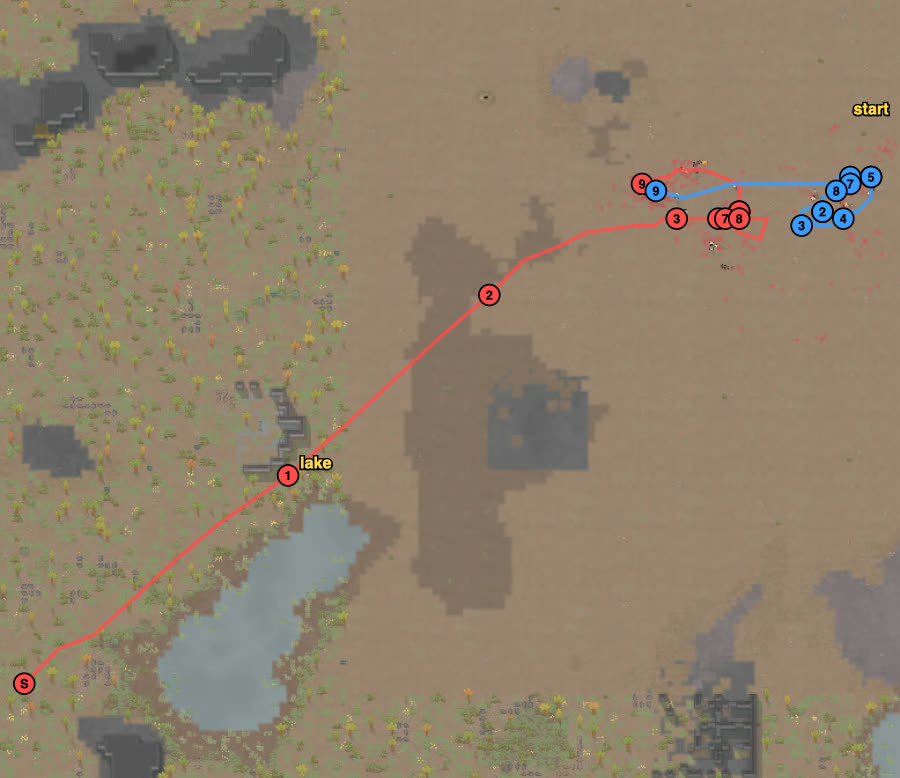
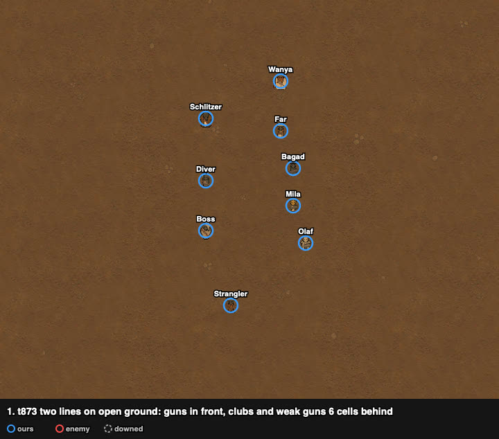
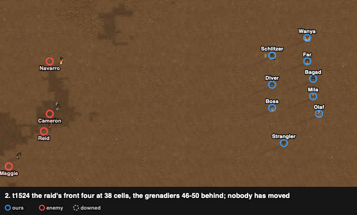
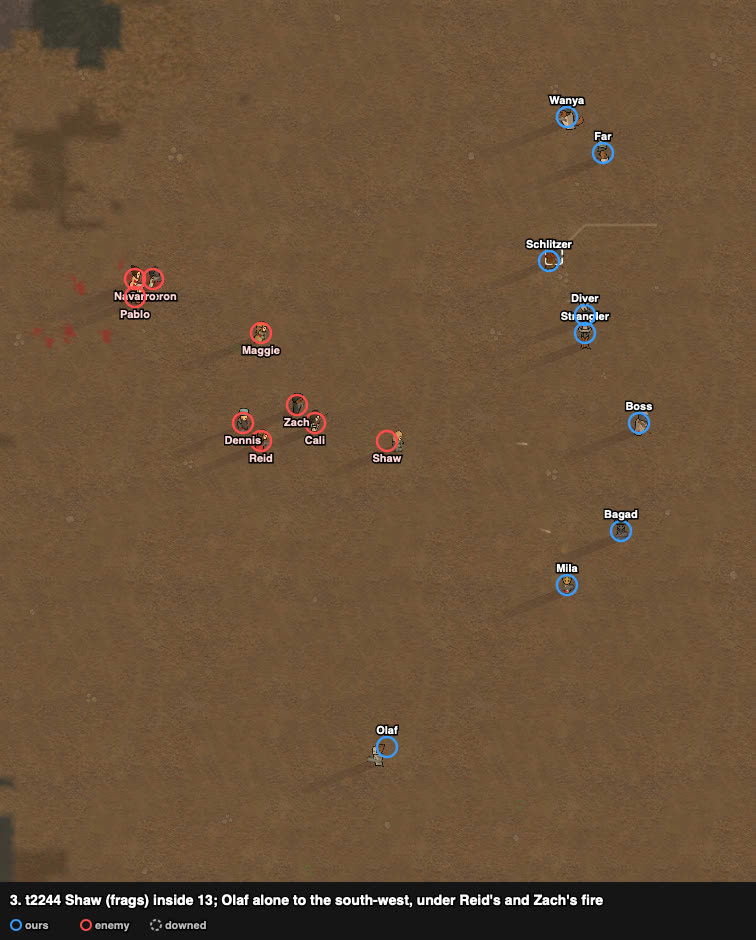
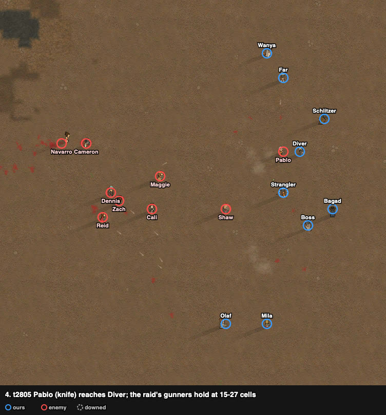
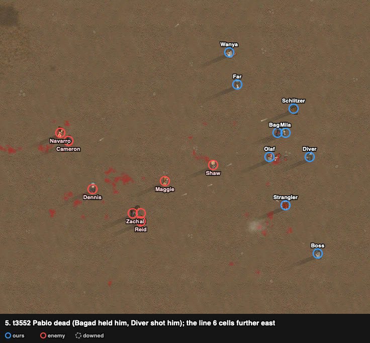
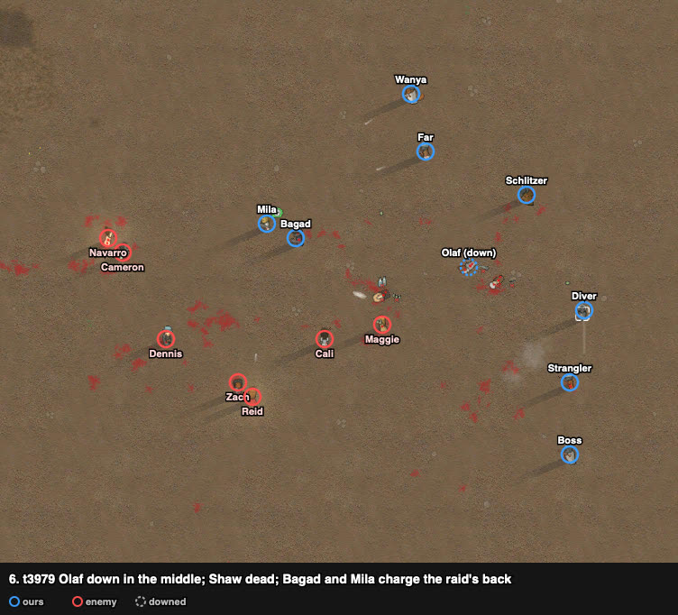
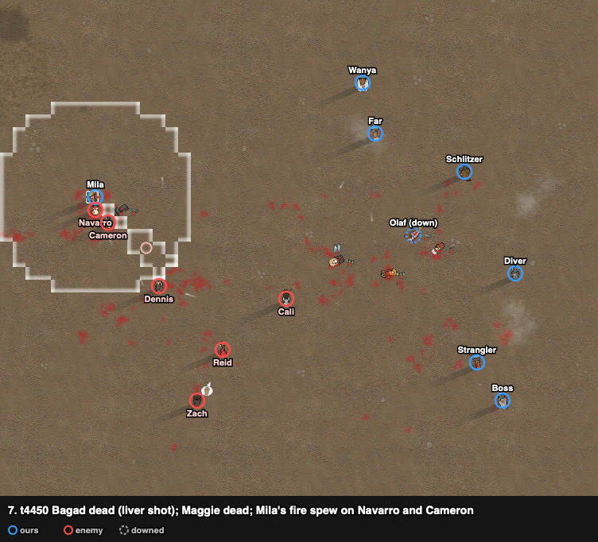
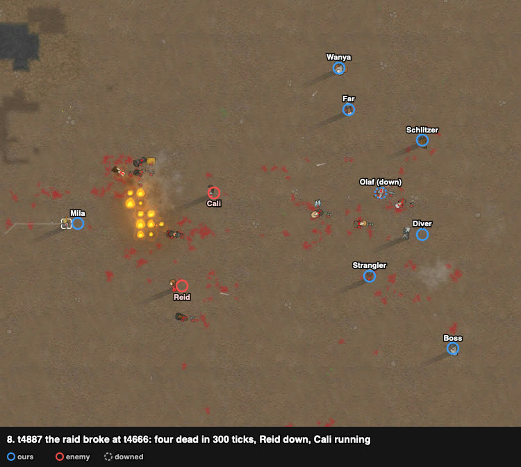
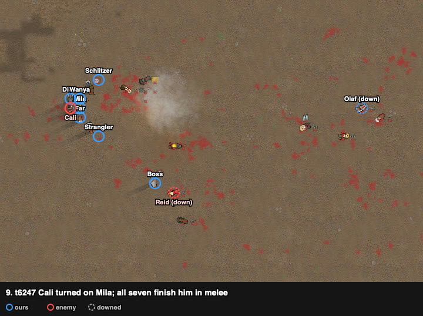

# rand_011: human + Claude's loadout vs agent (close), Waster pirates vs low-skill outlanders with two grenadiers

Worst-list #9. Enemies cleared, decisive: 1 of ours dead (Bagad), all nine raiders out. The
agent lost 3 to kidnapping with 4 more downed. First battle of the case-library phase
(results/cases/): nobody had played it before; the user played it, Claude watched.

**Problem.** arena_open_night, Strive to Survive, 500 v 500 pt. Our squad starts at (125, 125);
the raid walks in from the west edge, (0–16, 47–67), ~140 cells away.

| ours (9 Waster pirates) | shooting / melee | weapon at start | after the loadout |
|---|---|---|---|
| Schlitzer | **13** / 10 | bolt-action rifle | same |
| Boss | **13** / 10, Iron-willed | granite club (28%) | **bolt-action rifle** (Bagad's) |
| Diver | **10** / 8 | marble club | **revolver (poor)** (Olaf's) |
| Strangler | 8 / 1 | pump shotgun | same |
| Wanya | 4 / 10, steel flak helmet | biocoded revolver | same (biocoded) |
| Olaf | 3 / 3 | revolver (poor) | **marble club** |
| Mila | 3 / 4, Bloodlust; **Fire spew** ability | steel club | same |
| Far | 1 / 4, Jogger | biocoded autopistol | same (biocoded) |
| Bagad | 0 / 3 | bolt-action rifle | **granite club (28%)** |

Enemy (9 outlanders, everyone shoots 1–5): Shaw and Maggie frags, Cali pump shotgun (melee 6,
Nimble, Tough, flak vest), Reid and Zach machine pistols, Navarro and Dennis autopistols (Dennis
in full flak), Cameron revolver (poor), Pablo steel knife (Jogger).

## Result

| | human + loadout | agent (close), no loadout |
|---|---|---|
| outcome | **enemies cleared, decisive** (raid broke at t4666) | raid left with captives (defeat) |
| colonists lost | **1** (Bagad, dead) | 3 (kidnapped) |
| downed at end | 1 (Olaf, carried back) | 4 |
| raiders out | **9 of 9** (8 dead, Reid downed) | 5 (4 dead, 1 downed); 4 escaped |
| first contact | t1683 (the raid came to us) | t857 (the agent advanced) |
| HP lost (sum) | **320%** | 611% |
| badness | **25.8** | 106.4 (76.4 without the kidnap double count) |

The agent's game, from its row: it closed in by ~t1130, killed both grenadiers, Pablo and Reid
by t3239 without a loss, then held; from t4930 it lost pawns one by one to kidnapping.

## Route

From the trace. The squad stayed on the open ground 5–15 cells west of the start and gave a
few cells east as the fight went on; the raid walked north-east past the west lake and came
straight at it.

## Timeline

Two lines facing west-south-west, 4–6 cells apart: Schlitzer, Diver, Boss and Strangler in
front (x 114–116), the clubs and the weak guns 6 cells behind. Nobody moved until the raid
arrived.

The raid's front four at 38 cells, the grenadiers 46–50 behind. First hit at t1683:
Schlitzer's rifle on Navarro at 27 cells. By t2117 the two rifles and Diver's revolver had hit
Navarro (twice, 44%), Maggie, Dennis and Cameron at 17–28 cells; the raid's first hit on us
came at t1956 (Mila).

Shaw (frags) inside 13 cells. Olaf (marble club) went alone to the south-west towards him;
from t2512 Reid's and Zach's machine pistols hit him (leg, eye, jaw, shoulder).

Pablo (knife) reaches Diver. The raid's gunners stop at 15–27 cells ("watching for targets").
About ten frags came in between t2375 and t4617 (trace); the combat log, which keeps only
recent entries, shows no frag injury, and every wound it shows on us is a bullet.

Pablo dead (Bagad held him in melee from t2912; Diver's revolver). The squad has stepped
6 cells further east (x 120–131). Both grenadiers within 13; Strangler down to 61% (Reid's
machine pistol in the leg; the liver shot followed at t3722).

Olaf downed in the middle (t3817, Reid). Shaw dead (t3939: Strangler's shotgun, Wanya).
Bagad and Mila charge through the raid to its wounded back pair, Navarro (44%) and Cameron
(68%).

Bagad dead: Dennis's autopistol hit his liver at t3896 during the charge; he died ~360 ticks
later. Maggie dead (t4433, Diver's revolver). Mila used her **Fire spew** on Navarro and Cameron
(t4512–4515): Navarro died burning, Cameron was seared.

Four raiders died in 300 ticks — Dennis (Boss, t4443), Navarro (fire spew, t4515), Cameron
(Boss, t4648), Zach (Far, t4711) — and the raid broke at t4666. Reid down (Boss, spine, t4902);
Cali ran.

Cali turned on Mila; all seven standing finished him in melee. Olaf was carried to the group.

## What it showed (observations)

1. **The skilled guns fought the approach alone.** Two shooting-13 rifles (one from the
   loadout) and Diver's revolver (from the loadout) hit four raiders at 17–28 cells between
   t1683 and t2117; the raid (median range 20) hit back from t1956. The agent's game had Boss
   and Diver holding clubs.
2. **The raid's gunners held at 15–27 cells and came no closer**; what came in were the
   knife (Pablo) and the two grenadiers, one at a time, and each died near our line.
3. **Our losses came from leaving the line**: Olaf alone on the south-west flank (downed by
   the machine pistols), Bagad in the charge through the raid (liver shot). The pawns that
   stayed in the line were wounded, not downed.
4. **Reid** (machine pistol, shooting 4) did most of our damage (Olaf, Strangler, Mila) and was
   untouched until t4158.
5. **A gene ability decided a moment:** Mila's Fire spew (not in the battle card: `hands.brief`
   did not list abilities) killed Navarro and set the ground burning among the raid's back.
6. The raid broke at t4666 with 7 of 9 out; there was no long fight, so no kidnapping. The
   agent, which killed four without loss early, lost its three in the long fight after t4900.

## Case retrieval, first use (results/cases/sheets/rand_011_start.md)

The sheet (3 closest: rand_029, rand_107, rand_039) was written before the battle and opened
after it; the player did not see it. What it predicted from rand_029 (same west edge, same
map): the raid at about (76, 113) at t1719, within rifle range of the start around t2000. Seen:
the raid's front at (75–76, 111–123) at t1524, first hit at t1683 (our line was 10 cells further
west). Its error: it read Boss's weapon condition (granite club 28%) as Boss's health. Its sites
(rand_029's line east of the start, the small ruin) were not used; the player held open ground
west of the start.

## Data

- row: `results/human/play.jsonl` (rand_011, `human_loadout`); agent row: `results/night/router.jsonl`
- trace: `../traces/rand_011_human_loadout_20261005-092131.jsonl.gz`
- watcher records (`tools/watch.py`): `../raw/rand_011/`; frames: `../raw/build_reports.py`
- case card: `results/cases/cards/rand_011.md`
