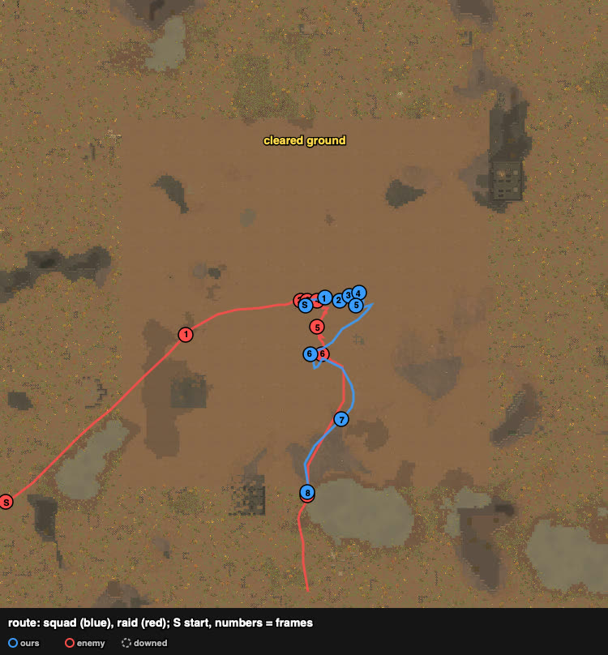
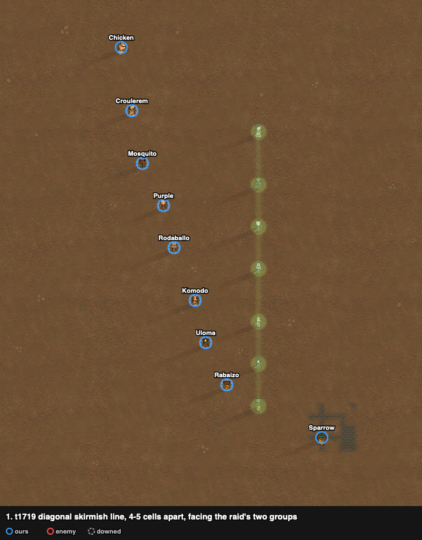
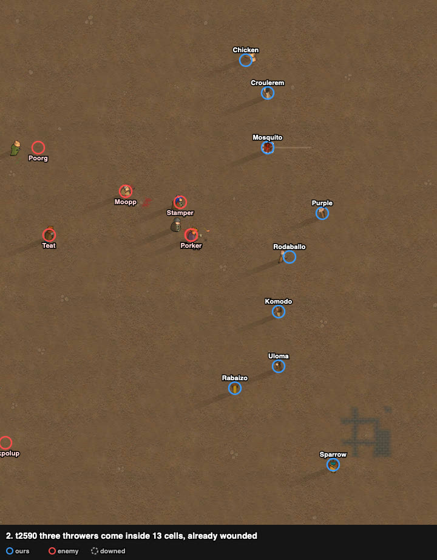
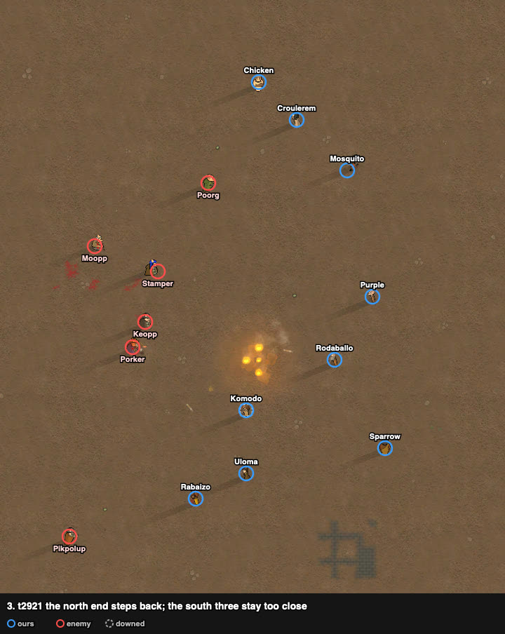
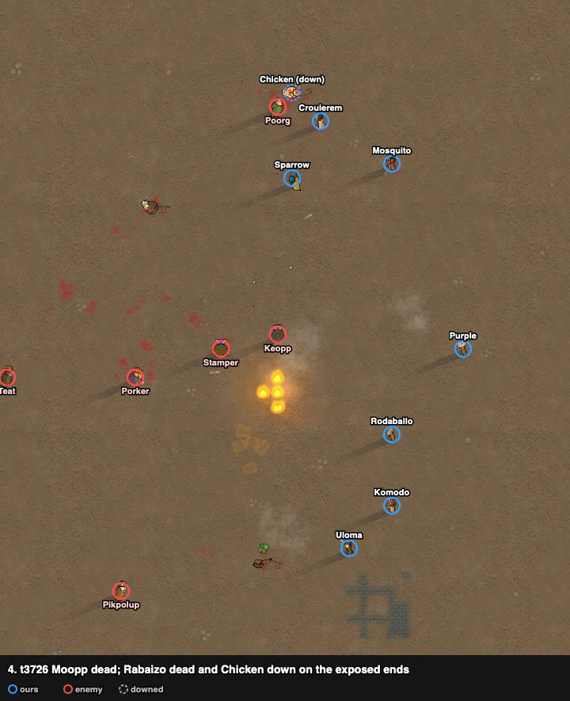
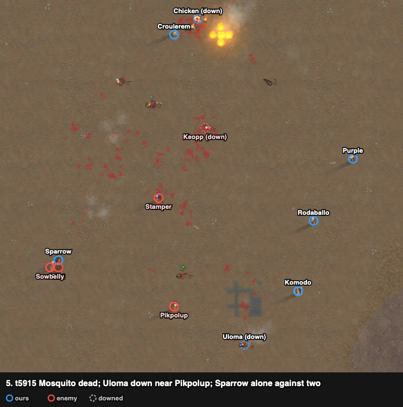
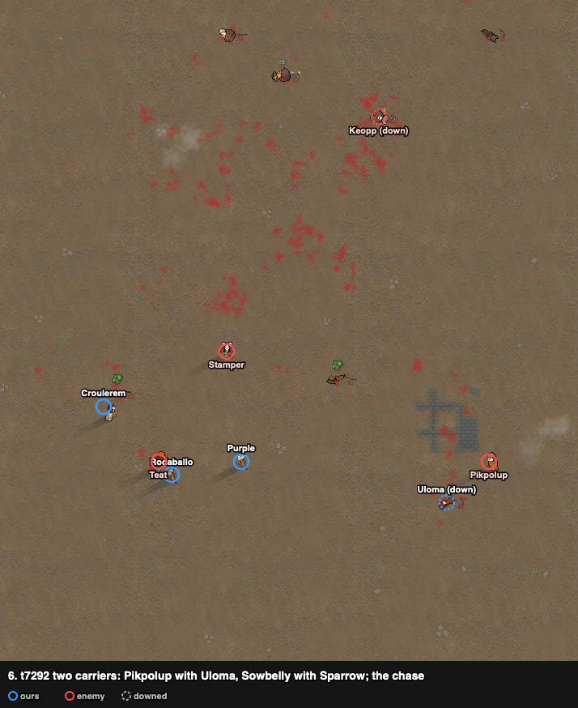
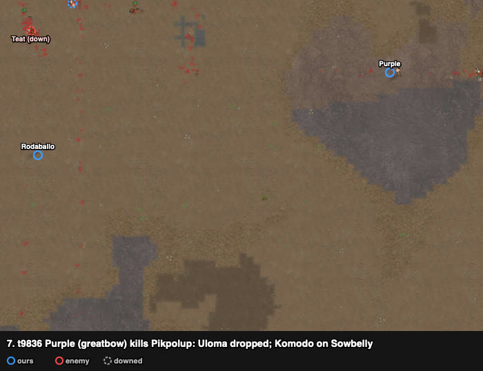
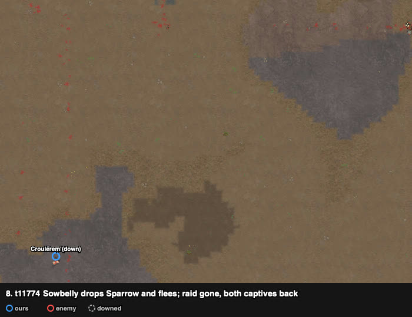

# rand_029: human + Claude's loadout vs agent (doctrine, stand_off), tribal bows vs four grenadiers

Worst-list #7. Pyrrhic win: the raid gone, 2 of ours dead, both kidnapped pawns taken back.
The agent lost 7 of 9. Second attempt; the first was abandoned after a control mistake.

**Problem.** arena_open_night, Strive to Survive, 500 v 500 pt. The raid starts at the west
edge, 147 cells away.

| ours (9 tribals) | shooting / melee | weapon (after the loadout) |
|---|---|---|
| Purple | **14** / 7 | **greatbow (good)**, range 30 (was Mosquito's) |
| Rabaizo | 9 / 4 | pila |
| Rodaballo | 8 / 10 | recurve bow |
| Croulerem | 8 / 3 | **short bow (normal)** (was Uloma's) |
| Sparrow | 5 / 8 | steel ikwa |
| Mosquito | 4 / 5 | short bow (poor) (was Purple's) |
| Komodo, Chicken | 3 / 5 | short bow (poor), wooden club |
| Uloma | 0 / 4 | short bow (poor) |

Enemy (8 pig outlanders): four throwers (frags: Pikpolup, Keopp, Stamper; molotov: Porker,
melee 12), revolver (excellent), pump shotgun, autopistol, knife.

## Result

| | human + loadout | agent (doctrine, vs_throwers=stand_off) |
|---|---|---|
| outcome | enemies cleared, **pyrrhic** (raid fled t9429) | enemies cleared, graded defeat |
| dead | **2** (Rabaizo, Mosquito) | 7 |
| kidnapped | **0** (Uloma and Sparrow taken back) | 0 |
| downed at end | 4 | 0 |
| raiders out | 4 dead + 3 downed (1 fled) | 5 (2 escaped) |
| LER | **0.90** | 0.23 |
| HP lost (sum) | 491% | 751% |
| badness | **55.6** | 110.0 |

## Route

The squad held a line east of the start; the end of the route is the chase south after the
two carriers.

## Timeline

A diagonal skirmish line, 4–5 cells between pawns, against a raid in two groups.

Three throwers come inside 13 cells already wounded: the bows (23–30) worked on them first.

The north end steps back out of throw range; the south end stays. Rabaizo dies and Chicken goes
down on the exposed ends (one grenade did most of it, the player says).

Mosquito dead; Uloma down beside Pikpolup; Sparrow alone in the west against two.

The raid switches to kidnapping: Pikpolup carries Uloma east, Sowbelly carries Sparrow south.

Purple chases and kills Pikpolup with the greatbow: Uloma dropped. Komodo stays on Sowbelly.

Sowbelly drops Sparrow and flees; the raid is gone and both captives are back.

## What it showed

1. **Spacing works against throwers, width doesn't.** The line was 4–5 cells between pawns
   (good against frags) but 43 cells end to end (squad radius 21.6 when the raid came within
   15): the ends were out of mutual support, and every loss happened on an end.
2. **Kidnap response, done right:** chase the carrier, stop, shoot; a carrier can't fight back
   and walks slowly. Two of two recovered.
3. **Loadout:** the greatbow in Purple's hands (14) made the long chase shot.

## Lessons for the model

- Against throwers: spacing 3–5 cells, but a compact front (keep every pawn within reach of
  two neighbours); step back out of 13 cells as a whole line, not one end.
- Kidnap response as a reflex: carriers become the top target; the nearest shooters pursue,
  stopping to fire.

## Data

- row: `results/human/play.jsonl` (rand_029, `human_loadout`); agent row: `results/night/router.jsonl`
- traces: `../traces/rand_029_human_loadout_20261005-072437.jsonl.gz`, attempt 1 `_try1`
- watcher records and notes: `../raw/rand_029/`; frames: `../raw/build_reports.py`
