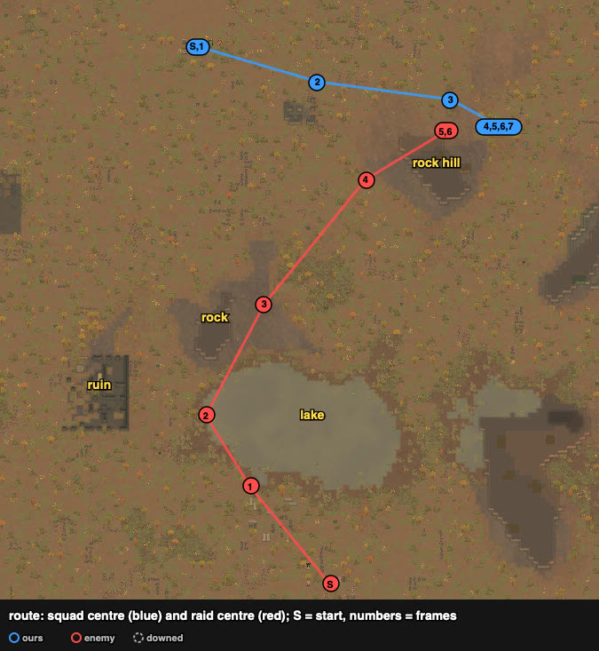
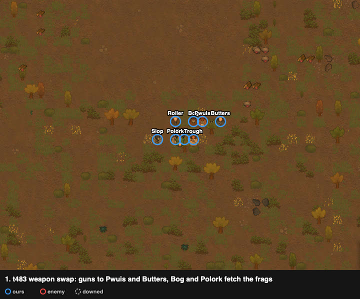
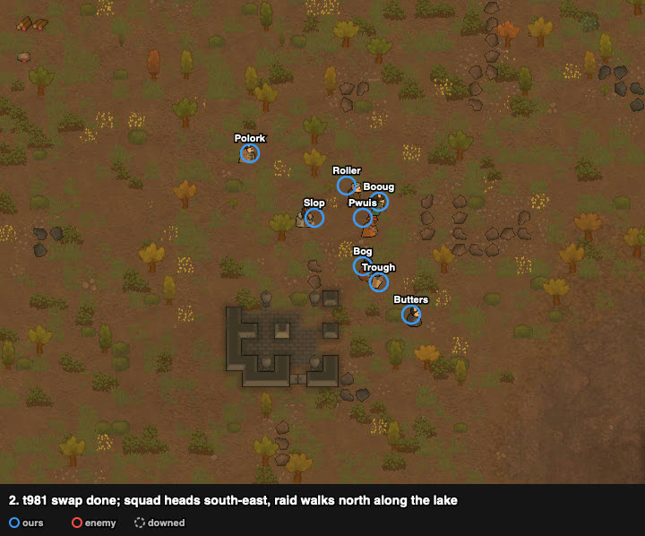
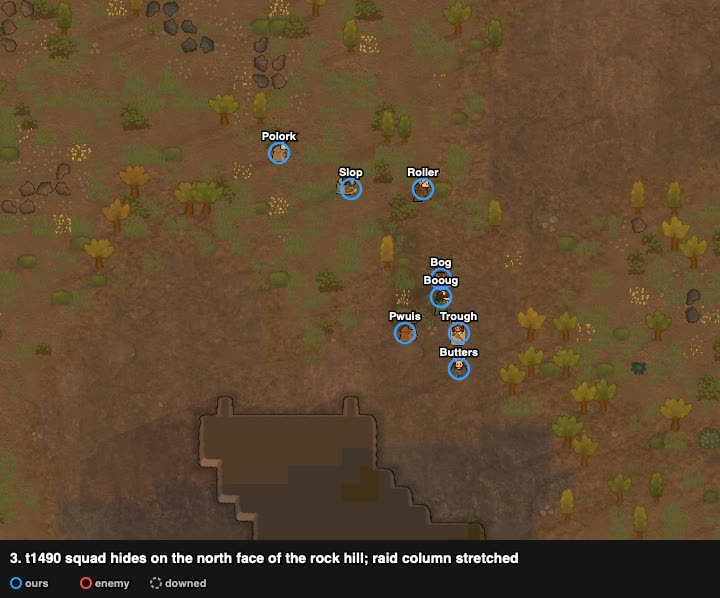
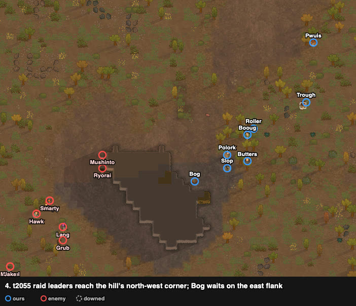
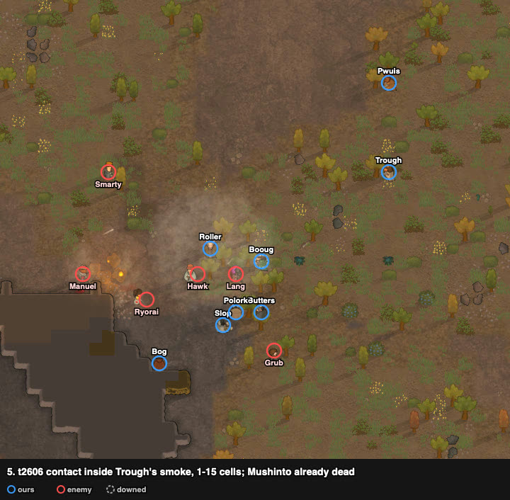
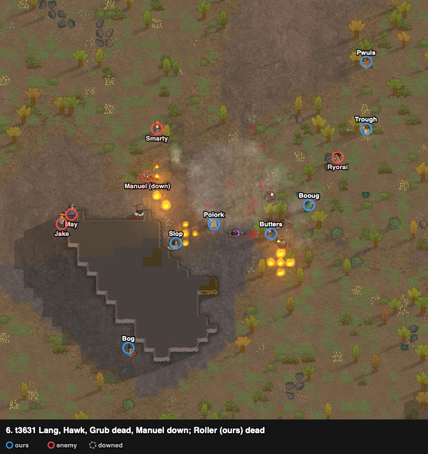
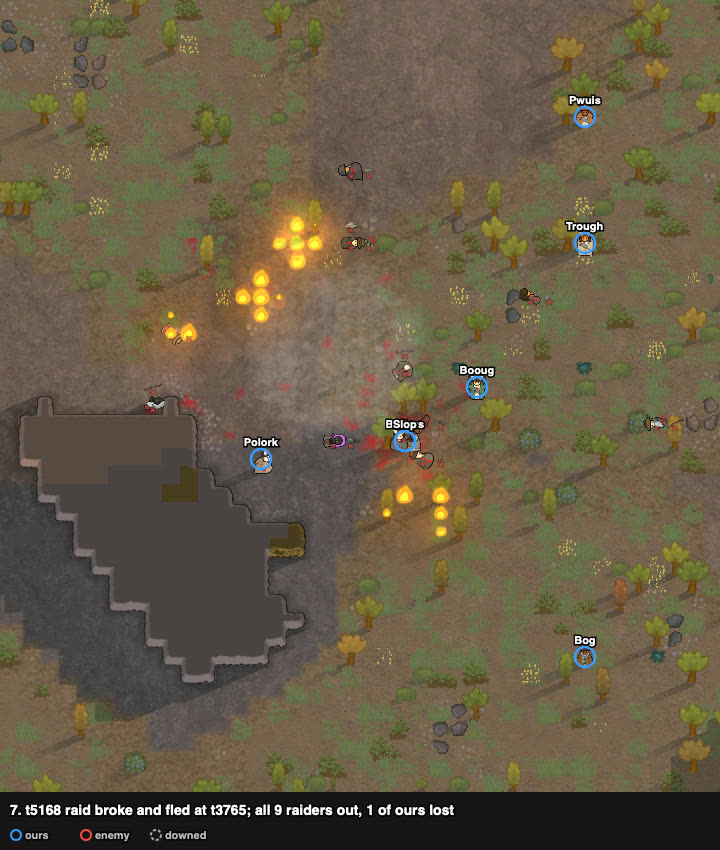

# rand_030: human (weapon swap) vs agent (close)

Worst-list #3 of the router night run. The human won outright; the agent lost 7 of 8.
Second attempt: the first one (to the west edge, abandoned at t2928) taught where the raid walks.

**Problem.** arena_forest_night, Strive to Survive, 500 v 500 pt. The raid starts on the south
edge, about 120 cells away, behind a lake.

| ours (8 outlanders) | weapon at start | shooting / melee | weapon after the swap |
|---|---|---|---|
| Pwuis | frag grenades | **9** / 3 | **revolver (good)** |
| Butters | frag grenades | 6 / **11** | **machine pistol** |
| Trough | revolver + smokepop pack | 4 / 4 | same |
| Roller | pump shotgun (poor) | 3 / 4 | same |
| Booug | machine pistol | 3 / 4 | machine pistol (poor) |
| Slop | molotov cocktails | 2 / 4 | same |
| Bog | revolver (good) | **0** / 0 | **frag grenades** |
| Polork | machine pistol (poor) | **0** / 1 | **frag grenades** |

Enemy (9 outlanders): **Mushinto** pump shotgun (shooting 14, melee 12), May revolver (8, helmet),
Jake bolt-action rifle (range 37), Lang heavy SMG, Smarty frag grenades, Manuel machine pistol,
Hawk autopistol, Ryorai revolver, Grub knife.

## Result

| | human (swap) | agent (close) |
|---|---|---|
| outcome | **enemies cleared, decisive** | raid left with captives, defeat |
| colonists lost | **1** (Roller, dead) | 7 (5 dead, 2 kidnapped) |
| raiders out | **9 of 9** (6 dead, 2 more inferred, 1 downed) | 3 (6 escaped) |
| LER | **2.25** | 0.11 |
| HP lost (sum) | 277% | 700% |
| first contact | t1785 | t887 |
| badness | **21.1** | 128 (108 without the double count) |

t = game ticks since the scenario loaded (60 ticks = 1 s at speed 1). The raid fled at t3765.

## Route

The squad went east, not to the raid. The raid walked round the west side of the lake and
then north-east to the rock hill, where the squad was waiting on the far side.

## Timeline

Swap at the start, with the raid 100 cells away: Butters and Pwuis drop their frags and take
the guns of the two zero-skill shooters. It took about 1000 ticks, which was affordable only
because the raid was far.

The squad settles on the north face of the rock hill, out of the raid's sight. Nobody advances.

The raid has to come round the hill's north-west corner. Whoever comes round first is inside
13–16 cells: the range of the frags and the shotgun.

Contact inside Trough's smoke, at 1–15 cells. Mushinto (the top threat) is already dead; molotov
fires on the corner and on Hawk.

Lang, Hawk and Grub dead, Manuel down; Roller is our only loss. Bog (frags) works round the
south of the hill towards Jake and May.

The raid broke at t3765; the runners were shot down. No colonist was downed at the end, so
nobody could be kidnapped.

## Why it worked

1. **Loadout.** The two best shooters got the guns; the frags went to the two who cannot shoot.
   Frag grenades land somewhere inside a fixed radius, so (assumption, not yet measured)
   shooting skill matters little for them.
2. **Wait where the raid must come close.** A short-range squad (half the weapons reach 13–16)
   hid behind a sight-blocking hill. The raid only saw us after it had walked into our range.
   The agent advanced into the open and met the raid's rifle and revolvers at their range.
3. **Smoke and fire at contact.** The smoke blunted their first volley; molotovs went into the
   bunch in the smoke.
4. **Top threat first.** Mushinto died in the first exchange.

## Lessons for the model

- **Strategic: weapon redistribution** before contact when the raid is far: guns by shooting
  skill, throwables to the worst shooters. Decided together with the doctrine (frame 1).
- **Strategic / tactical: ambush for short-range squads.** Wait behind terrain that blocks sight
  so the raid has to round a corner inside our range (frames 3–5). This contradicts the night-run
  router choice (close) for "throwers + short guns vs a raid that outranges us".
- **Tactical: smoke at contact, molotov into the smoke, top threat first** (frame 5).

**Caveats.** Second attempt with knowledge of the raid's route; the swap and the ambush changed
at the same time, so their shares are not separable. One battle is a hypothesis.

## Data

- row: `results/human/play.jsonl` (scenario rand_030, agent `human_swap`); agent row:
  `results/night/router.jsonl`
- watcher records (positions, jobs, screenshot paths): `../raw/rand_030/` (files before 0530 are
  the abandoned first attempt); frames: `../raw/build_reports.py`. No trace: played before traces.
