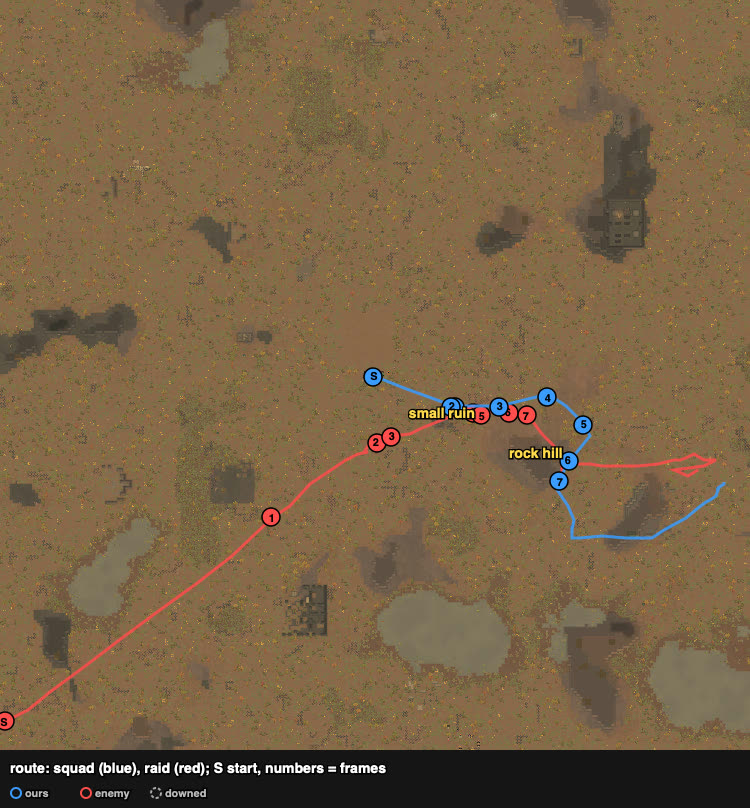
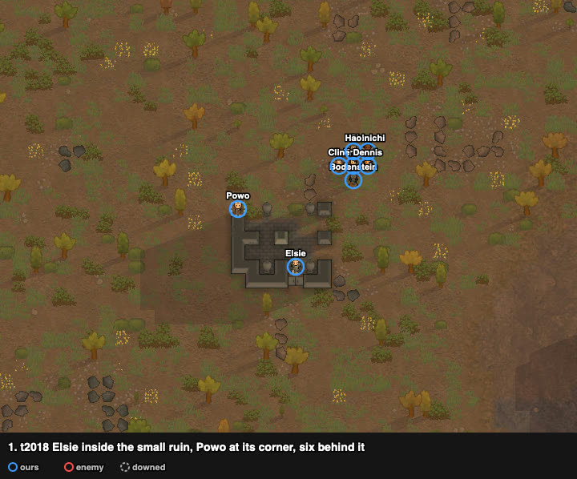
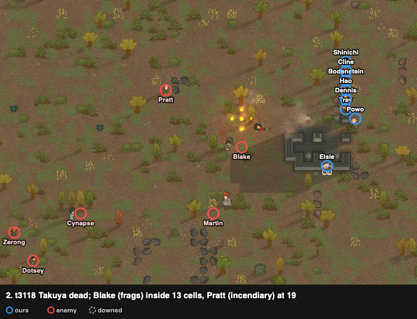
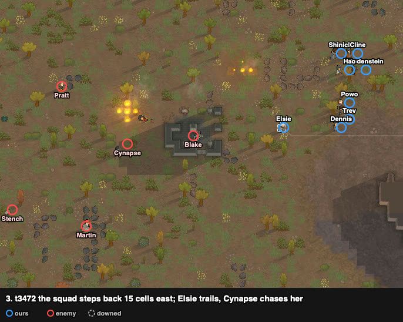
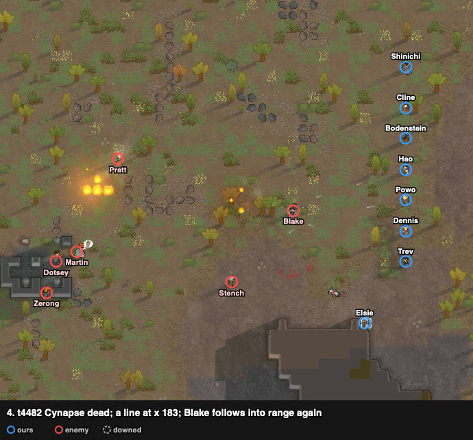
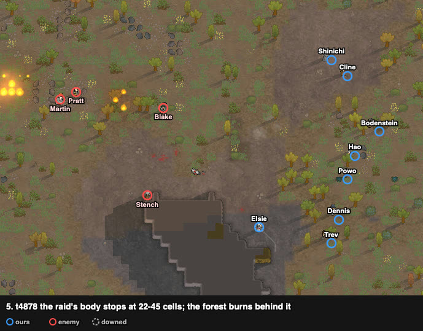
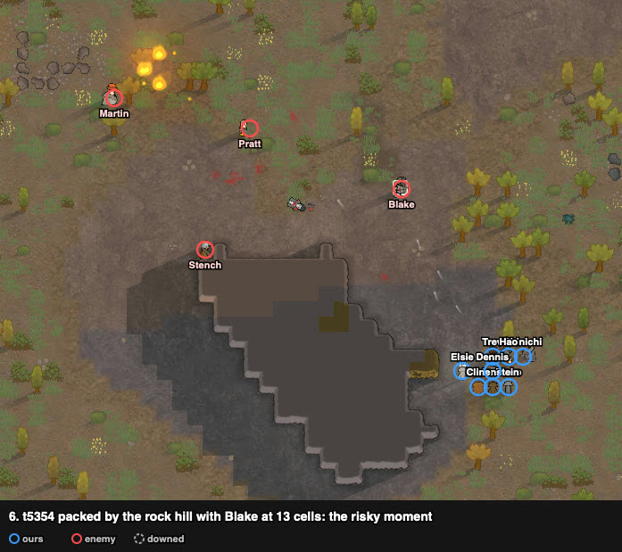
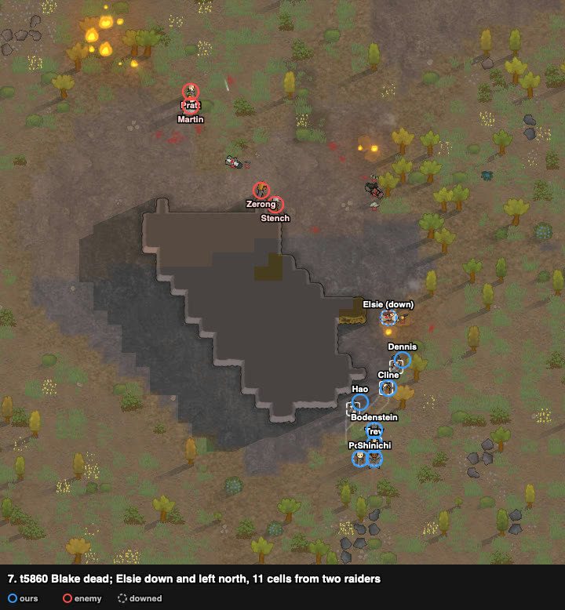

# rand_039: human + Claude's loadout vs agent (kite), low-skill gunners vs civil outlanders

Worst-list #8. Repelled with no one lost (Elsie downed, carried along); the agent lost 5 of 8.

**Problem.** arena_forest_night, Strive to Survive, 500 v 500 pt. The raid starts in the
south-west corner, 169 cells away.

| ours (8 outlanders) | shooting / melee | weapon |
|---|---|---|
| Elsie | **6** / 0 | autopistol (poor) → **heavy SMG** (loadout) |
| Trev | 4 / 6 (flak) | autopistol |
| Powo | 4 / 1 | bolt-action rifle |
| Hao | 4 / 1 | heavy SMG |
| Dennis | 4 / 1 | revolver (good) |
| Shinichi | 0 / **10**, brawler | heavy SMG → **autopistol (poor)** (loadout) |
| Bodenstein | 0 / 3 | autopistol |
| Cline | 0 / 1 | incendiary launcher (kept: it lands like a thrown weapon) |

Enemy (8 civil outlanders): **Pratt** incendiary launcher (shooting 10, melee 10), Martin
revolver (good), **Blake** frag grenades (melee 8), two bolt-action rifles (shooting 0 and 3),
a pump shotgun, two knives.

## Result

| | human + loadout | agent (kite) |
|---|---|---|
| outcome | **repelled** | raid left with captives (defeat) |
| colonists lost | **0** | 5 (3 dead, 2 kidnapped) |
| downed at end | 1 (Elsie, carried along) | 1 |
| raiders out | **6** | 2 |
| raiders escaped | 2 (Pratt, Dotsey) | 4 |
| HP lost (sum) | **125%** | 626% |
| badness | **8.0** | 108.0 (88.0 without the double count) |

The raid turned to kidnapping at t6872 with Elsie as its target, and failed.

## Route

From the trace: the squad held the small ruin, then fell back east round the rock hill to the
map edge, the raid following in pieces.

## Timeline

At the small ruin (squad radius 6.2 cells when the raid came within 15).

Takuya (knife) runs in first and dies. Blake (frags) is inside 13 cells, Pratt at 19.

The squad steps back 15 cells at a time. Whoever follows arrives alone: Cynapse dies, then Blake
comes into range again.

The raid's body stops at 22–45 cells and waits; the forest burns between the sides.

The risky moment: all eight packed by the rock hill with Blake at 13 cells.

Blake dead. Elsie is down and left to the north; the squad carries her off to the east edge,
and the raid's kidnapping fails.

## What it showed

1. **Fall back in steps and kill the followers.** The raid's gunners stopped at their own range
   (22–45 cells), but the knives and the grenadier kept following and arrived one at a time.
   The same play as rand_067 (kite to stretch the raid), here with a gun squad.
2. **Take the downed with you.** Elsie was the kidnap target; carrying her off with the squad
   left the raid nothing to take.
3. The one lapse was packing eight pawns by the rock hill with a grenadier at 13 cells
   (frame 6); it went unpunished.

## Lessons for the model

- Tactical play: **stepped withdrawal** — retreat one bound (10–15 cells), turn, kill whoever
  followed into range, repeat; never pack while a thrower is within 13.
- Kidnap response includes **carrying the downed along** when withdrawing.

## Data

- row: `results/human/play.jsonl` (rand_039, `human_loadout`); agent row: `results/night/router.jsonl`
- trace: `../traces/rand_039_human_loadout_20261005-074437.jsonl.gz`
- watcher records and notes: `../raw/rand_039/`; frames: `../raw/build_reports.py`
