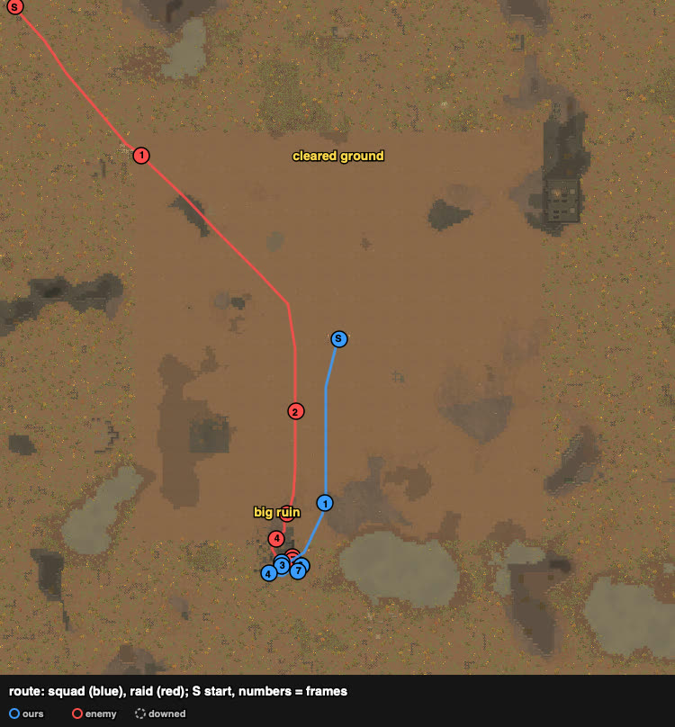
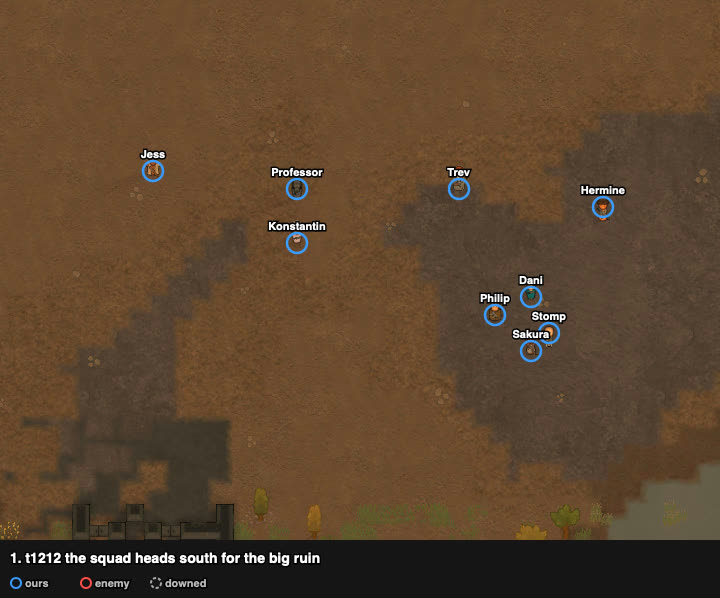
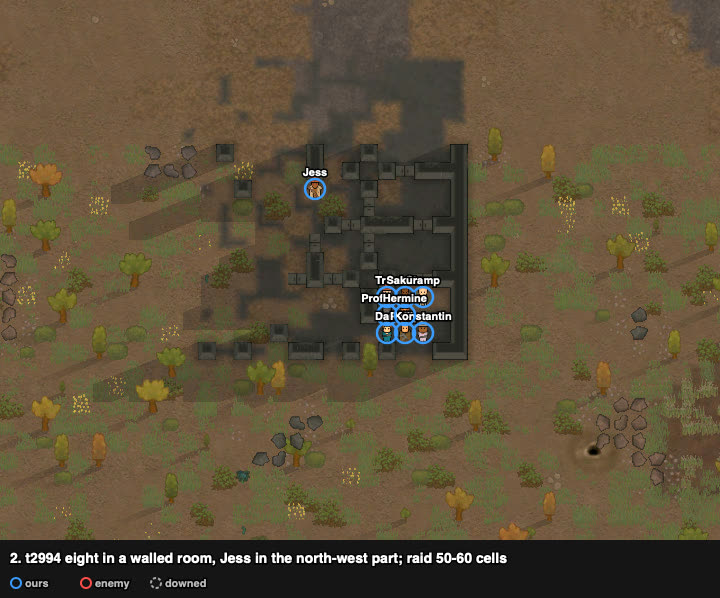
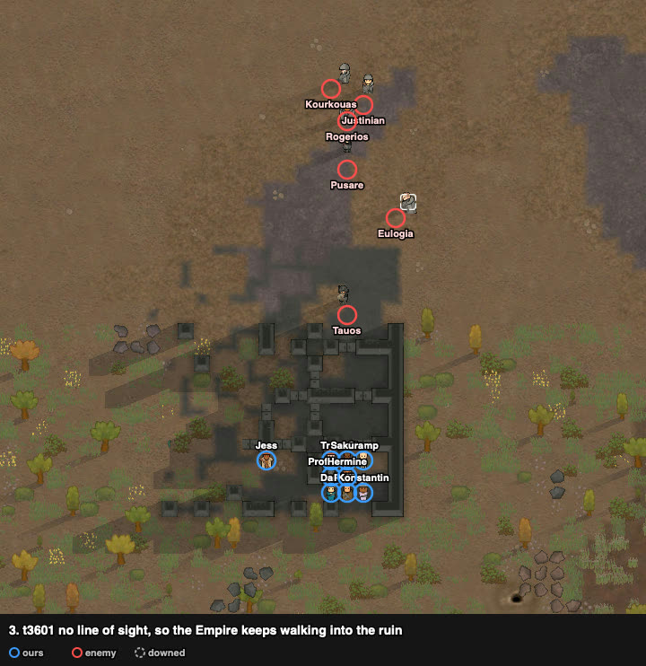
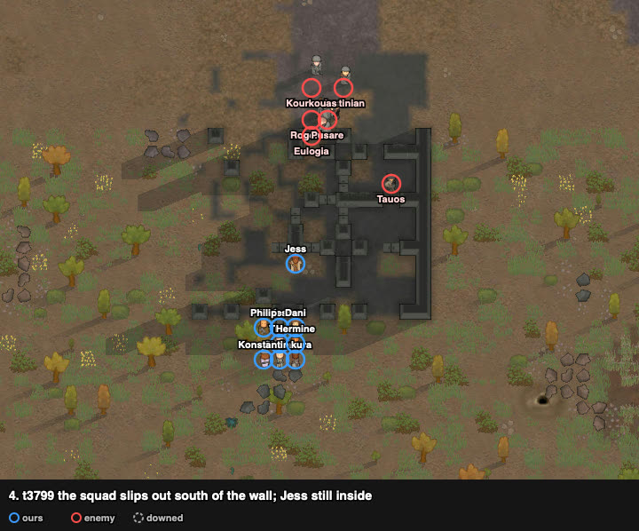
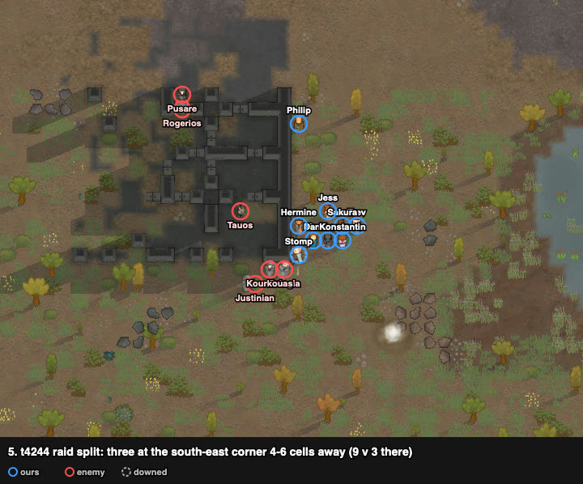
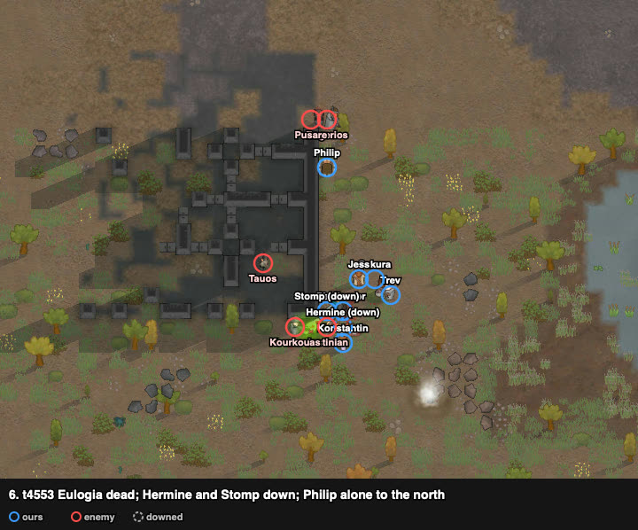
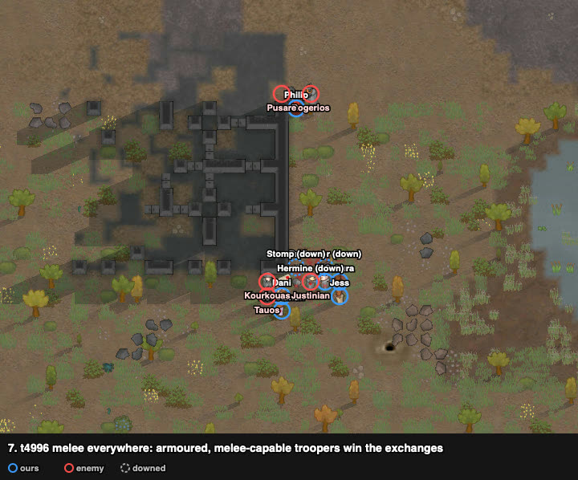

# rand_065: human + Claude's loadout vs agent (close), civil outlanders vs Empire troopers

Worst-list #6. About a draw: both sides ended with the squad beaten and three of ours being
carried off. Second attempt; the first (abandoned at ~t3600) showed how the Empire fights.

**Problem.** arena_open_night, Strive to Survive, 500 v 500 pt. The raid starts in the
north-west corner, 172 cells away.

| ours (9 outlanders) | shooting / melee | weapon at start | after the loadout |
|---|---|---|---|
| Jess | **16 / 14** | steel knife (poor) | **bolt-action rifle** (range 37) |
| Hermine | 10 / 4 | steel knife | **heavy SMG** |
| Sakura | 6 / 0 | steel knife | **pump shotgun** |
| Trev | 6 / 11 (flak) | autopistol (good) | same |
| Philip | 3 / 3 | pump shotgun | machine pistol (poor) |
| Professor | 2 / 4 | steel knife | same |
| Stomp, Dani, Konstantin | 0–1 / 0 | heavy SMG, bolt-action, machine pistol | steel knives |

The best three shooters held knives and three non-shooters held the guns: the agent charged
like that and lost Jess first. Enemy (6 imperial troopers, all in flak, two in recon armour):
LMG ×2 (Justinian shooting 10), charge lance (Tauos, range 33), hellcat rifle, heavy SMG ×2
(Eulogia melee 11, Kourkouas melee 9).

## Result

| | human + loadout | agent (close) |
|---|---|---|
| outcome | squad down (defeat) | raid left with captives (defeat) |
| dead | 0 | 1 |
| kidnapped | 0 recorded; **3 were being carried off** when the harness stopped | 3 |
| downed at end | 9 | 3 |
| raiders out | 3 (Eulogia, Justinian, Kourkouas) | 3 |
| HP lost (sum) | 584% | 633% |
| badness | 64.4 recorded, ~94 counting the three carried off | 114.3 (84.3 without the double count) |

The harness stops at squad down, so kidnappings that finish later are not counted (TODO: keep
watching until the raid is gone). After the stop, Konstantin was carried off, and Trev got up
and downed Stomp's carrier.

## Route

## Timeline

Attempt 1 learned the Empire's habit: from a ruin corner in sight, they stopped at 19–27 cells
(their LMG and SMG range, not ours) and shot. This time eight wait in a walled room.

With no line of sight they keep walking into the ruin (squad radius 4.4 cells when the raid
came within 15).

The raid splits round the ruin; three come round the south-east corner at 4–6 cells: nine of
ours against three there.

Eulogia dies, but Hermine (heavy SMG) and Stomp go down, and Justinian's melee ties up the
group. Philip stands alone to the north.

Melee everywhere. Armoured troopers with melee 9–11 beat knives and fists; the squad goes down.

## What it showed

1. **Breaking line of sight brings the Empire in.** In the open they hold at their own range;
   behind walls they walk into ours. That part worked.
2. **The loadout did not fit the play.** Jess got the 37-cell rifle for a fight that happened
   at 4–6 cells. With melee 14, a knife (or Sakura's shotgun) would have used Jess better.
   The loadout has to be chosen with the play and the site, not on skill alone.
3. Knives against armour do little; only Jess, Trev, Hermine and Sakura had real damage.

## Lessons for the model

- **(play, site, loadout) is one decision.** Close-quarters ambush → shotguns and the best
  melee pawns' blades; stand-off → rifles to the best shooters.
- **Against Empire raids, cut line of sight** to make them advance; they otherwise hold at
  19–27 cells.
- **Count kidnappings after squad down** (harness).

## Data

- row: `results/human/play.jsonl` (rand_065, `human_loadout`); agent row: `results/night/router.jsonl`
- traces: `../traces/rand_065_human_loadout_20261005-070306.jsonl.gz`, attempt 1 `_try1`
- watcher records and notes: `../raw/rand_065/`; frames: `../raw/build_reports.py`
