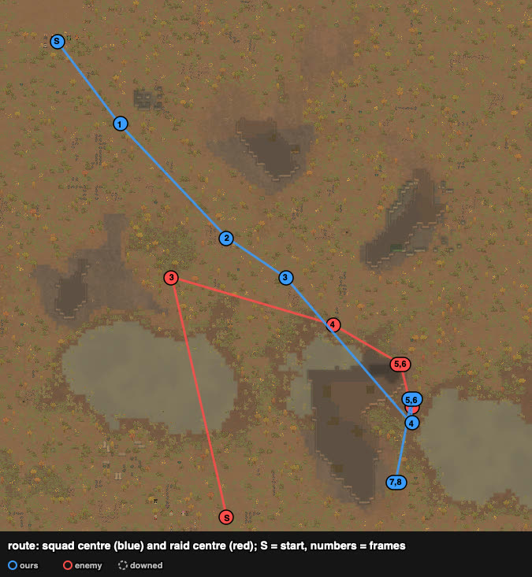
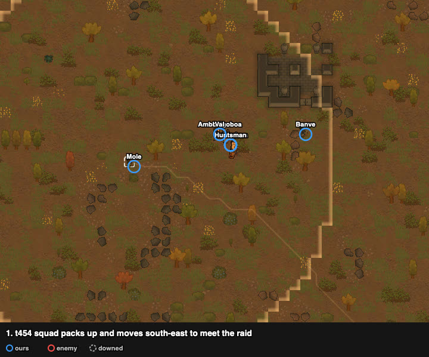
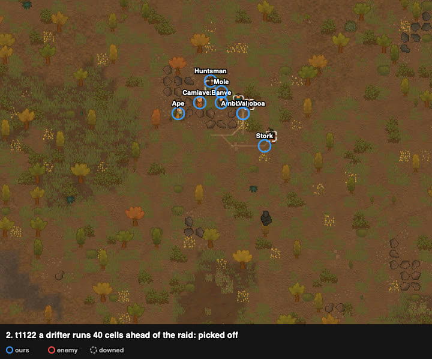
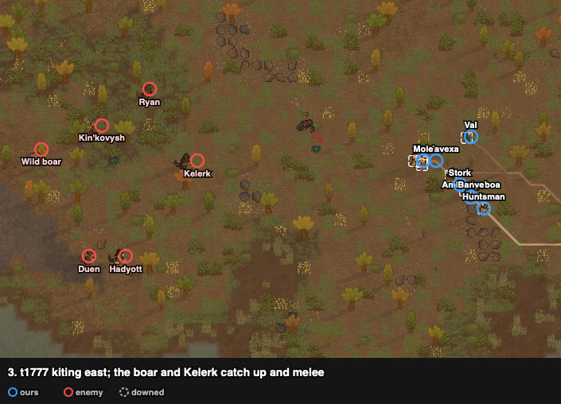
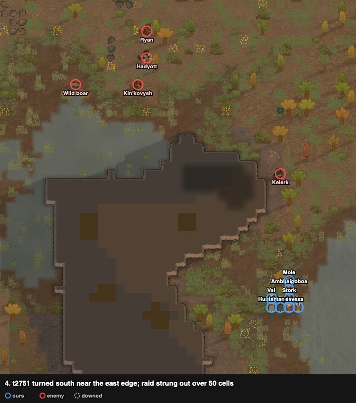
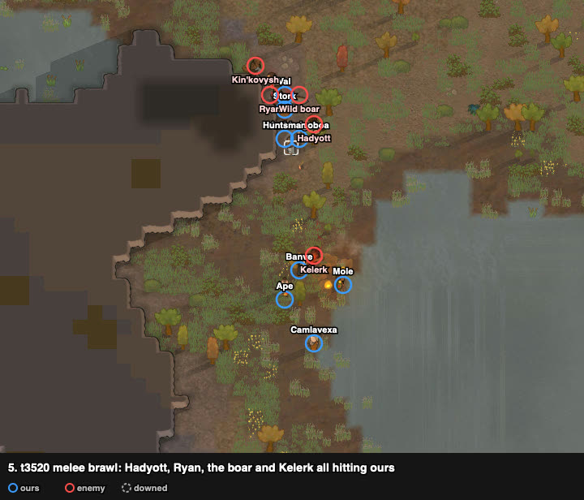
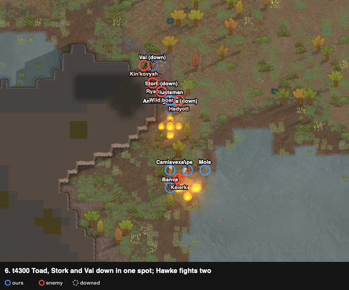
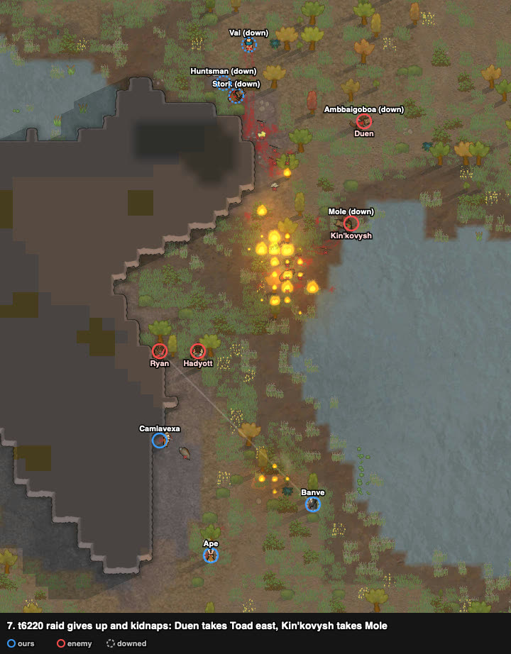
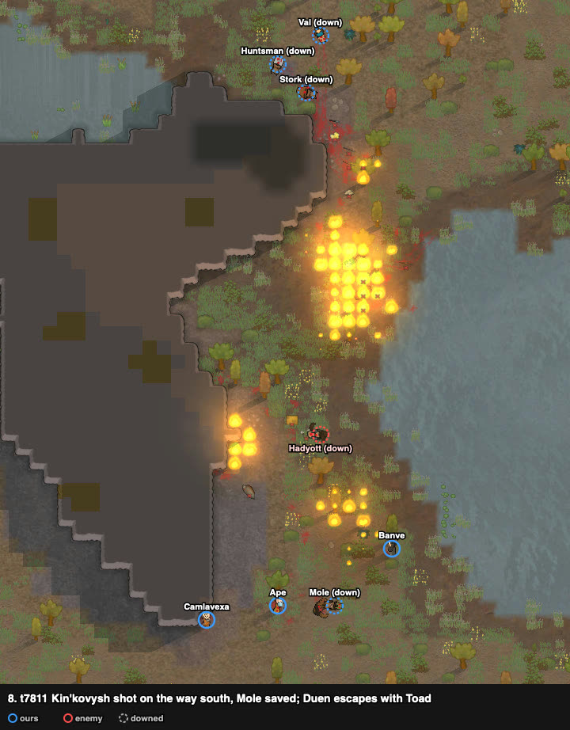

# rand_067: human vs agent (kite), tribal bows vs Yttakin

Worst-list #2 of the router night run. Both graded defeat (one colonist carried off is enough),
but the human lost 1 where the agent lost 6.

**Problem.** arena_forest_night, Strive to Survive, 500 v 500 pt. The raid starts on the south
edge, about 130 cells away.

| ours (8 tribals; map name) | weapon | shooting / melee |
|---|---|---|
| Val | steel ikwa (poor) | 12 / 10 |
| Toad (Ambbaigoboa) | pila | 11 / 11, slowpoke |
| Hawke (Huntsman) | greatbow (poor), range 30 | 10 / 6 |
| Banve | short bow (poor) | 8 / 8 |
| Ape | recurve bow | 7 / 3, jogger |
| Mole | pila | 4 / 8 |
| Irodo (Camlavexa) | short bow (poor) | 4 / 0 |
| Stork | steel spear | 0 / 5 |

Enemy (7 Yttakin): Hadyott (molotov grenadier), two scavengers (pump shotgun, revolver), a pirate
(Kin'kovysh, machine pistol), two drifters with clubs (Kelerk, Kottytt), a wild boar.

## Result

| | human | agent (kite) |
|---|---|---|
| outcome | raid left with captives (defeat) | raid left with captives (defeat) |
| colonists lost | **1** (Toad, kidnapped) | 6 (3 dead, 3 kidnapped) |
| raiders out | **4 dead + Hadyott downed** | 2 |
| raiders escaped | 2 (Duen with Toad, Ryan) | 5 |
| LER | **1.26** | 0.07 |
| HP lost (sum) | 417% | 687% |
| badness | 58.7 (48.7 without the double count) | 130.5 (100.5) |

## Route

## Timeline

A drifter outruns the raid by 40 cells and meets the whole squad alone: picked off (Kottytt).

Kiting east in a pack. The boar and Kelerk (melee) catch up first; the gunners trail.

Turned south near the east edge. The raid is strung out over 50 cells.

The melee arrives: Hadyott, Ryan, the boar and Kelerk all hit ours at the north spot. Val
(ikwa) charged in alone and went down first (t3652 "needs rescue").

Toad, Stork and Val down in one spot; Hawke fights two. Five down by t4700.

The raid switches to kidnapping: Duen carries Toad east, Kin'kovysh carries Mole south.

The three standing archers happened to be on the south exit: Kin'kovysh died on the way and
dropped Mole (saved). Duen went east and escaped with Toad.

## What worked, what failed

- Worked: packing up, picking off a runner, kiting to stretch the raid; standing on the
  kidnapper's exit route (frame 8).
- Failed: bows in melee. Once the clubs and the boar reached the squad, the archers fought in
  melee and went down one after another (frames 5–6). Val charging alone started it.

## Lessons for the model

- **Kidnap response:** when a raider's job becomes "kidnapping X", that carrier is the top target,
  and standing pawns move onto its path to the nearest edge (frames 7–8). A carrier can't shoot.
- **Bow squads against melee closers:** focus the melee closers before contact, or break contact
  once more; never let the best melee pawn charge alone (frame 5).
- **Kite stretches a raid** (frames 2–4): the fast melee arrive first and alone, which is the
  chance to kill them one by one.

## Data

- row: `results/human/play.jsonl` (rand_067, agent `human`); agent row: `results/night/router.jsonl`
- watcher records: `../raw/rand_067/`; frames: `../raw/build_reports.py`. No trace.
