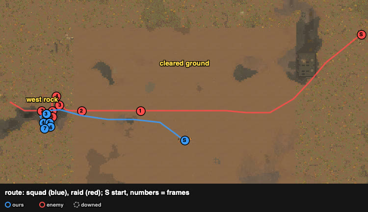
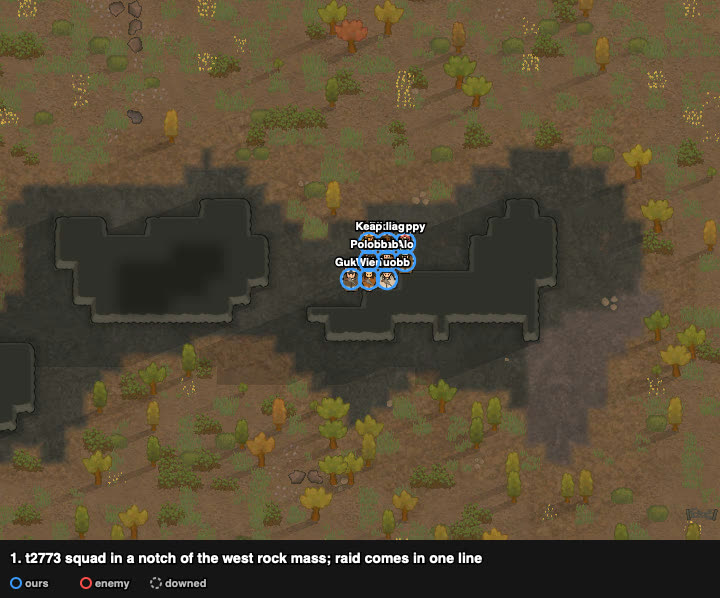
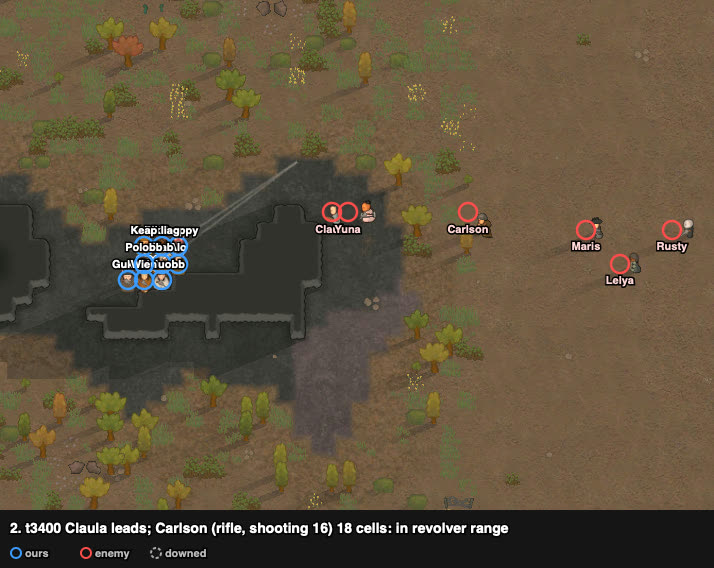
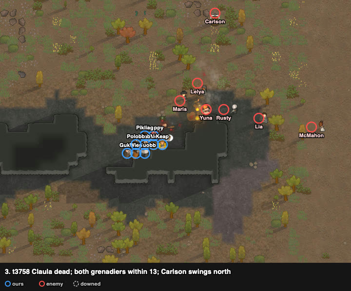
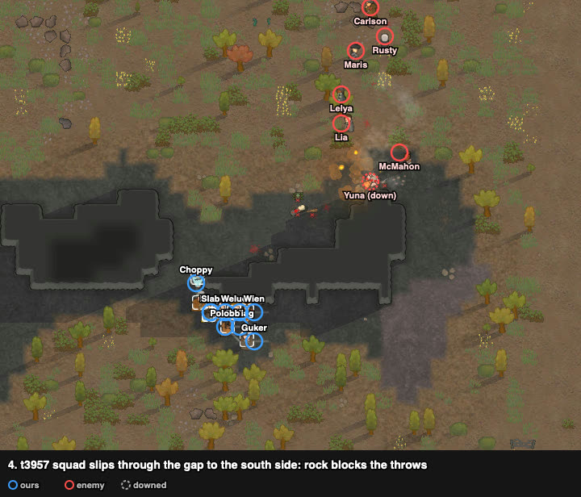
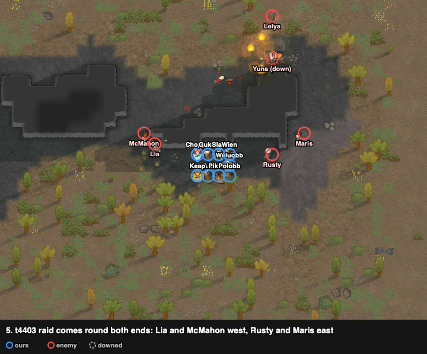
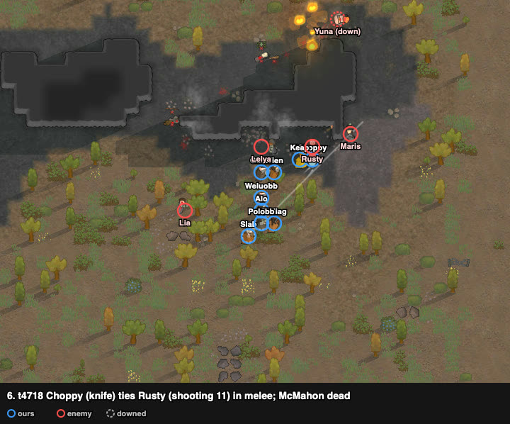
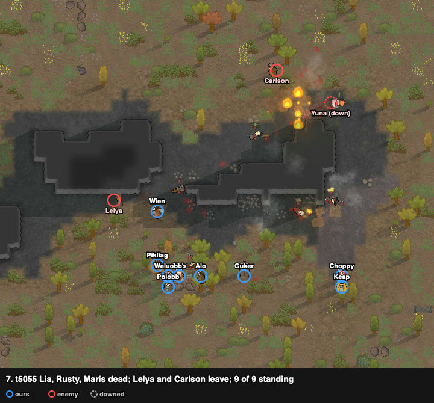

# rand_084: human + Claude's loadout vs agent (doctrine), low-skill gunners vs pirates with a sniper

Worst-list #4. The human won with no one lost or downed; the agent lost 6 of 9. First battle
with a trace (`traces/rand_084_human_loadout_20261005-061330.jsonl.gz`, 98 polls) and the first
loadout done by Claude (the player fought). Second attempt: the first one used the same plan and
was abandoned at ~t3900 after a misthrown grenade (trace `_try1`).

**Problem.** arena_open_night (cleared square in the middle, forest around), Strive to Survive,
500 v 500 pt. The squad starts in the middle of the cleared ground; the raid at the east edge,
140 cells away.

| ours (9 outlanders) | shooting / melee | weapon at start | **after the loadout** |
|---|---|---|---|
| Weluobb | **4** / 1 (flak vest) | steel knife (good) | **revolver (normal)** |
| Wien | 4 / 3 (low-shield pack) | molotov | revolver (poor) |
| Alo | 2 / 0 | revolver (normal) | autopistol (poor) |
| Guker | 2 / 3 | frag grenades | revolver (poor) |
| Pikliag | 1 / 3 | autopistol (poor) | same |
| **Choppy** | 0 / **6**, brawler | autopistol | **steel knife (good)** |
| **Keap** | 0 / **5**, brawler | revolver (poor) | **steel knife (poor)** |
| Slab | 1 / 1 | steel knife (poor) | **molotov** |
| Polobb | 0 / 2 | revolver (poor) | **frag grenades** |

The rule: guns by shooting skill, melee weapons to the brawlers, throwables to the worst shooters
(skill multiplies a gun's output far more than a grenade's; no throwing in melee). Eight drops
and pick-ups took ~140 ticks before anyone was drafted.

Enemy (8 pirates): **Carlson** bolt-action rifle (shooting 16, range 37), **Rusty** revolver (11),
McMahon bolt-action (3), Lia and Lelya frag grenades, Maris machine pistol, Yuna revolver,
Claula wooden club. Everyone but Carlson and Rusty shoots 0–4.

## Result

| | human + loadout | agent (doctrine) |
|---|---|---|
| outcome | **repelled** (raid fled at t4869) | raid left with captives (defeat) |
| colonists lost | **0** | 6 (4 dead, 2 kidnapped) |
| downed at end | 0 | 1 |
| raiders out | 6 (5 dead, Yuna downed); Carlson and Lelya fled | 3 (4 escaped) |
| HP lost (sum) | **44%** | 747% |
| first contact | t3122 | t1646 |
| badness | **1.8** | 124.9 (104.9 without the double count) |

## Route

From the trace. The squad walked ~95 cells west, away from the raid, off the open ground to a
rock mass in the forest; the raid followed in one line along z 143.

## Timeline

All nine in a notch of the west rock mass (squad radius 1.9 cells when the raid came within 15).

Claula (club) leads; Carlson is 18 cells away: inside our revolvers' range, so his range
advantage is gone.

Claula dead. Both grenadiers are within throwing range.

The squad slips through the gap to the south side. The rock now blocks the grenadiers' line of
sight; throws need it.

The raid comes round both ends of the rock: Lia and McMahon through the gap, Rusty and Maris
round the east end.

Choppy (knife, melee 6) ties down Rusty (shooting 11, melee 0); McMahon dead.

Lia, Rusty and Maris dead. The raid flees at t4869; Carlson and Lelya escape. Nobody of ours
was ever downed, so nothing could be kidnapped.

## Why it worked

1. **Loadout:** the two brawlers became the melee answer (Choppy won the duel with Rusty); the
   best shooters held guns.
2. **Terrain that cancels range:** in the notch the raid had to come within revolver range, so
   the sniper's 37 cells did not matter.
3. **Breaking line of sight against throwers:** slipping through the gap put the rock between
   the grenadiers and the squad; they had to walk round, into short range.
4. **Melee on the right targets:** the knives went to the raiders who came round the ends.

The low-shield pack was not used.

## Lessons for the model

- Loadout step works in practice (two wins out of two: rand_030, rand_084).
- Tactical plays seen here: **notch hold** (3 sides blocked), **gap slip** (move through a gap
  so a rock breaks the throwers' sight), **knife the flankers**.
- Against a sniper, pick terrain where his range advantage cannot be used, instead of a duel.

## Data

- row: `results/human/play.jsonl` (rand_084, `human_loadout`); agent row: `results/night/router.jsonl`
- trace: `../traces/rand_084_human_loadout_20261005-061330.jsonl.gz` (the loadout shows as the
  weapon changing in the first polls); attempt 1: `_try1`
- watcher records and notes: `../raw/rand_084/`; frames: `../raw/build_reports.py`
