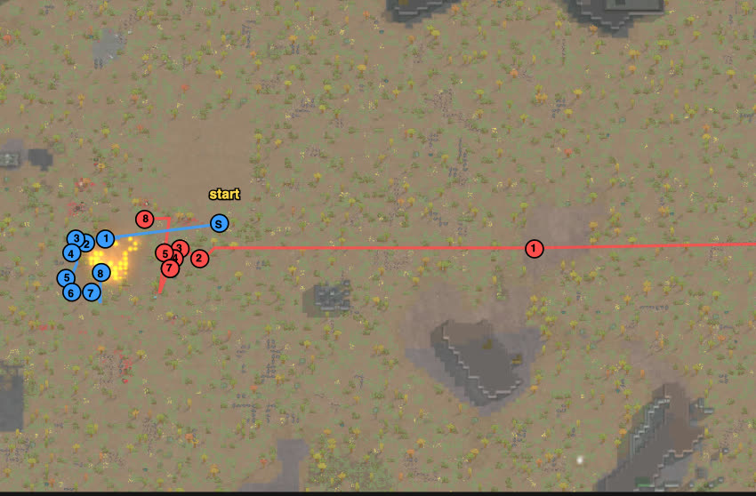
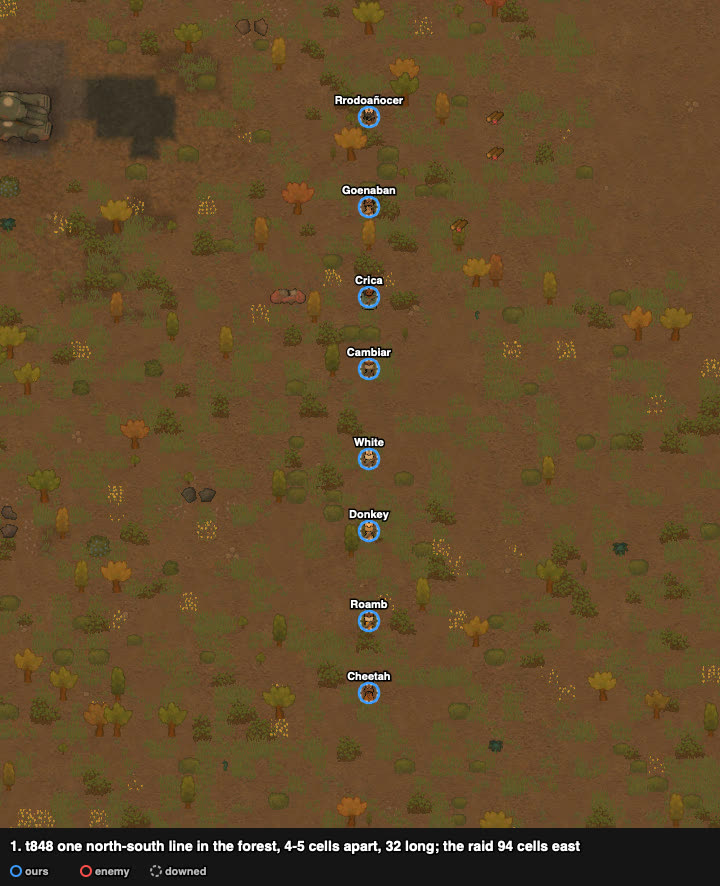
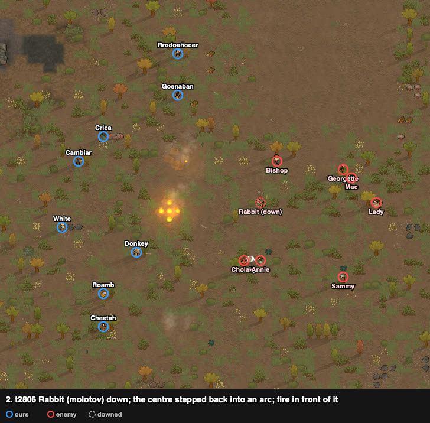
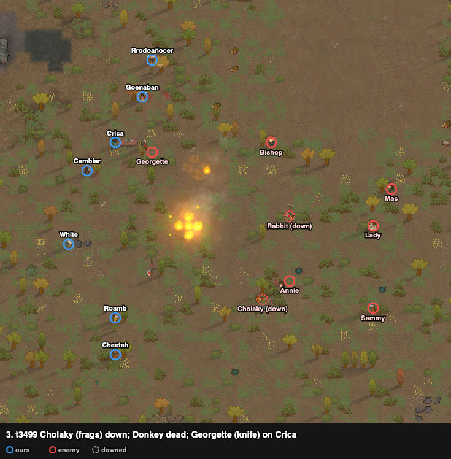
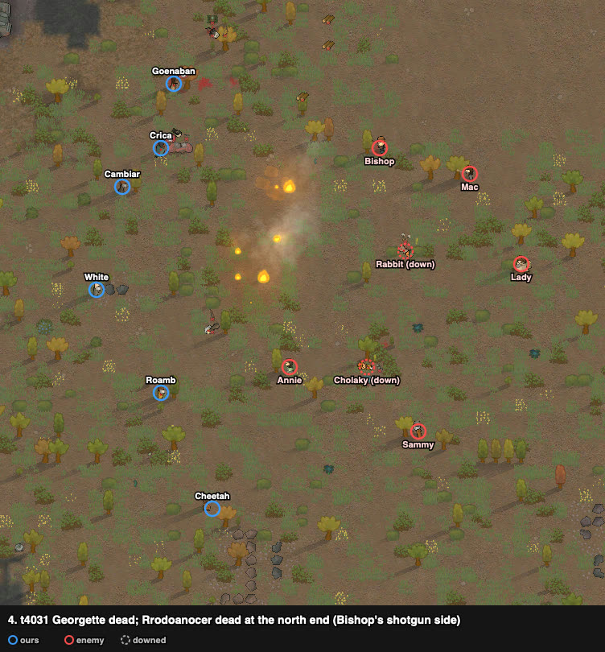
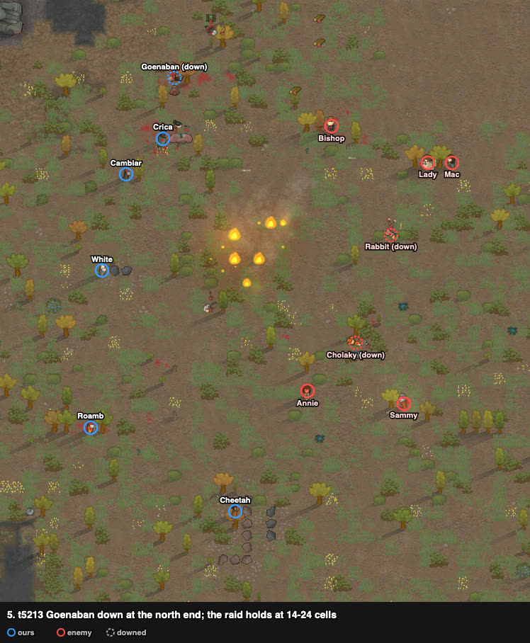
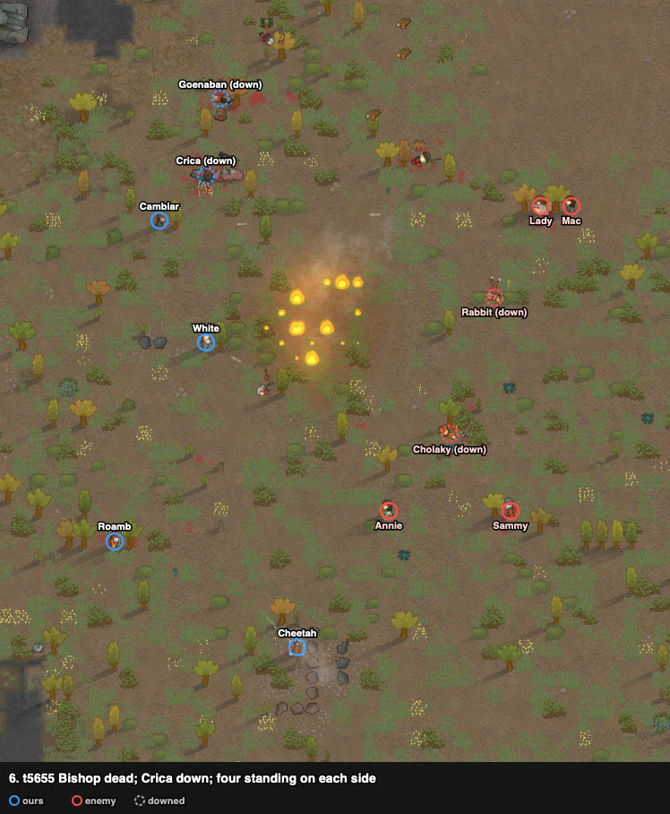
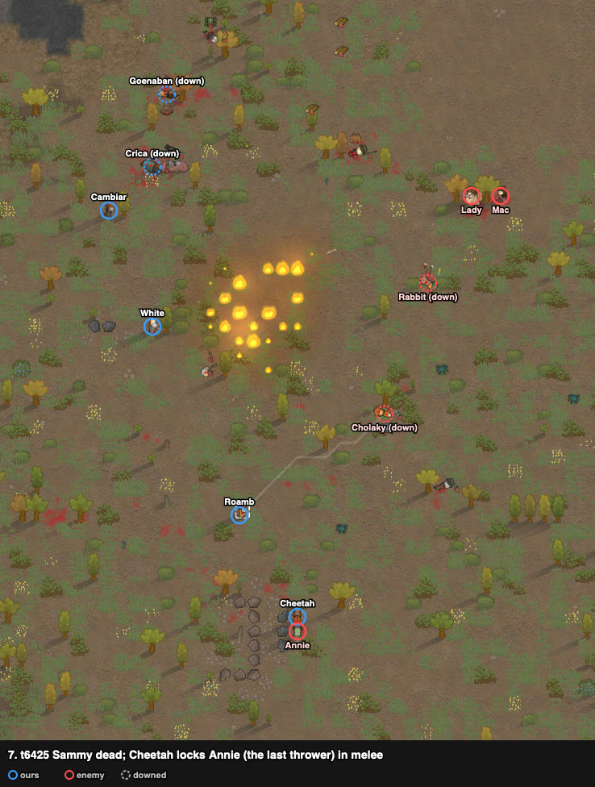
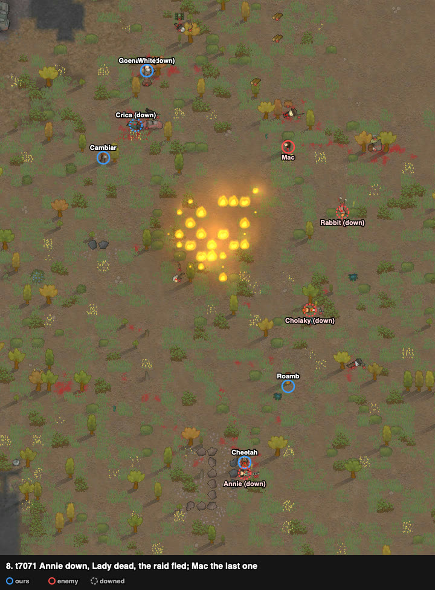

# rand_104: human + Claude's loadout vs agent (turtle), savage tribe's bows vs civil outlanders with three throwers

Worst-list #10. Enemies cleared, decisive: 2 of ours dead (Donkey, Rrodoañocer), 2 downed;
every raider out. The agent's squad went down: 4 dead, 4 downed, 8 permanent injuries.
Nobody had played it before; the user played it, Claude watched.

**Problem.** arena_forest_night, Strive to Survive, 500 v 500 pt. Our squad starts at
(125, 125); the raid walks in from the east edge, (244–249, 107–120), ~122 cells away.

| ours (8 savage tribals) | shooting / melee | weapon at start | after the loadout |
|---|---|---|---|
| Cambiar | **12** / 7 | recurve bow (poor) | **greatbow** (range 30, Goenaban's) |
| Crica | 9 / **12** | short bow (poor) | **recurve bow (poor)** (Cambiar's) |
| White | 7 / 6, Jogger, Bloodlust | recurve bow | same |
| Donkey | 6 / 0, Jogger | recurve bow | same |
| Roamb | 5 / 6 | recurve bow (60%) | same |
| Rrodoañocer | 5 / **10** | short bow | same |
| Goenaban | 4 / 7, Slowpoke | greatbow | **short bow (poor)** (Crica's) |
| Cheetah | 2 / 7, Tough | pila | same |

No armour, no melee weapons. Enemy (8 civil outlanders): **three throwers** — Cholaky frags
(shooting 10), Annie frags (flak vest), Rabbit molotovs (shooting 10, Jogger); Bishop pump shotgun
(shooting 10, flak vest); Sammy autopistol (good; 8/10, flak vest); Georgette steel knife (8/9,
Wimp); Lady revolver; Mac autopistol (poor, shooting 1).

## Result

| | human + loadout | agent (turtle), no loadout |
|---|---|---|
| outcome | **enemies cleared, decisive** (raid fled t6457, Mac killed t7128) | squad down (defeat) |
| dead | **2** (Donkey, Rrodoañocer) | 4 |
| downed at end | 2 (Crica, Goenaban) | 4 |
| permanent injuries | 1 | 8 |
| raiders out | **8 of 8** (5 dead, 3 throwers downed) | 4 |
| first contact | t1851 | t1350 |
| HP lost (sum) | **450%** | 688% |
| badness | **46.0** | 105.5 |

## Route

From the trace. The squad went 24 cells west into the forest and stayed there; the raid came
straight west along z 119.

## Timeline

One north–south line at x 101 (later 104), z 105–137: eight pawns 4–5 cells apart, 32 cells
long, Cambiar's greatbow in the middle. The player placed it where the greatbow at its longest
range reaches the slate chunks beside the raid's path with one cell to spare (28.9–29.8 cells
from Cambiar's cell; range 29.9). The raid walked in a column along z 119 with the
throwers in front.

In the forest the first hits came at ~11 cells (Rabbit, t2197), not at the bows' 23–30.
Rabbit (molotovs) threw first, into the line's centre; the fire burned there for the rest of
the battle (6 → 28 burning cells). **Rabbit downed t2582.** The centre (White, Cambiar, Crica)
stepped back to x 90–95, an arc with the wings forward. The player kept the greatbow from
dodging (every move costs it damage) and let the pawns around it take the molotov landings;
White stood in the middle to keep the line balanced.

**Cholaky (frags) downed t2980**: two of three throwers down with nobody of ours hurt yet.
Then the north end took Bishop's shotgun from 13–16 cells (Goenaban 76 → 44%). **Donkey
dead** between t3188 and t3250 at (99, 113), the pawn nearest the throwers: 100% at one poll,
dead at the next — one hit (the player recalls Lady's revolver, shooting 4, destroying his
head, but is not sure; the shooter's log went with the dead). The player rated Bishop (shotgun)
and Georgette (knife) the top threats; both came from the north, where the pressure was heavy,
while the south had room. Georgette (Wimp) went down without much cost, so little fire was
taken off Bishop. Georgette (knife) ran
in to Crica (melee 12).

Georgette dead (t3753; Crica 64%). **Rrodoañocer dead** at the north end (99, 136): 100 → 87
→ 50 → dead, t3833–4031, with Bishop 16 cells away. Annie (frags) at 10 cells from Roamb.

**Goenaban downed** (Bishop's shotgun, t4677). The raid's gunners held at 14–24 cells; both
sides wore each other down for ~2500 ticks. Annie threw about ten frags at the south group
(Roamb, Cheetah) between t3833 and t5781.

**Bishop dead** (t5269). **Crica downed** (Mac's autopistol, t5573). Four standing on each side.

**Sammy dead** (t5699). Cheetah (pila, Tough) went to Annie, the last thrower, and locked her
in melee so she could not throw; Roamb joined.

Lady dead and the raid fled (t6457); Annie downed in melee (t6710); Mac killed at t7128.

## What it showed (observations)

1. **In the forest the bows' range did not show.** First contact at ~11 cells; the fight was
   held at 10–24 cells, inside the throwers' and the shotgun's reach. The trees also hid our
   line until the raid was close.
2. **The throwers went first and early**: Rabbit and Cholaky down by t2980 with no loss of
   ours. The third, Annie, threw for 2000 ticks until Cheetah locked her in melee.
3. **The losses were on the line's north half and next to the throwers**: Donkey (nearest
   the throwers), then Rrodoañocer and Goenaban at the north end under Bishop's shotgun, then
   Crica. The line was 32 cells long (rand_029: every loss on an end of a 43-cell line).
4. Bishop (shotgun, shooting 10, flak vest) did most of the damage the surviving logs show
   (Goenaban three times, the last one downing him; Crica once) and lived until t5269.
5. The molotov's fire burned between the line's centre and the raid for the whole battle.
6. No kidnapping: the raid broke (t6457) with five of eight out.

## Data

- row: `results/human/play.jsonl` (rand_104, `human_loadout`); agent row: `results/night/router.jsonl`
- trace: `../traces/rand_104_human_loadout_20261005-101114.jsonl.gz`
- watcher records (`tools/watch.py`): `../raw/rand_104/`; frames: `../raw/build_reports.py`
- case card: `results/cases/cards/rand_104.md`
