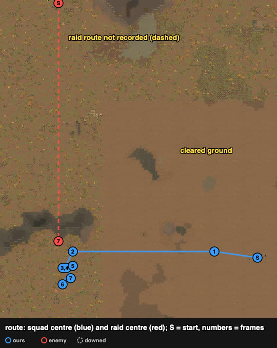
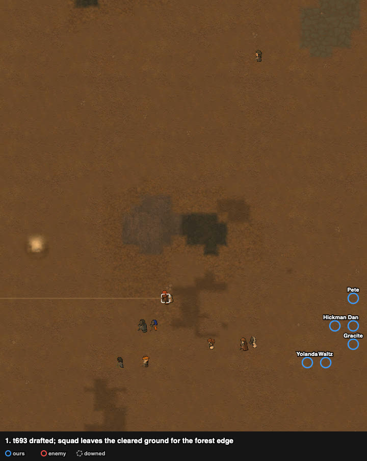
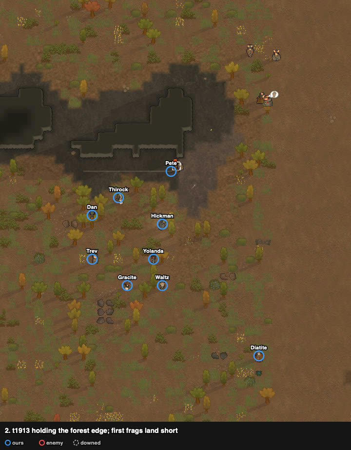
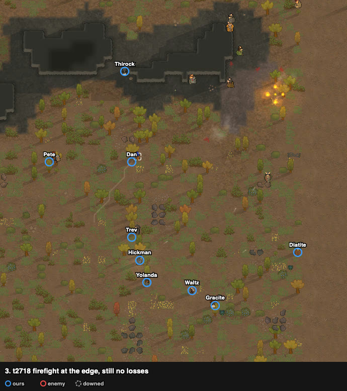
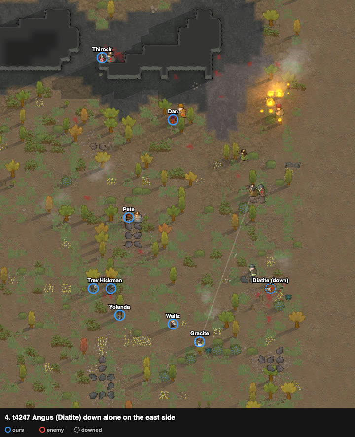
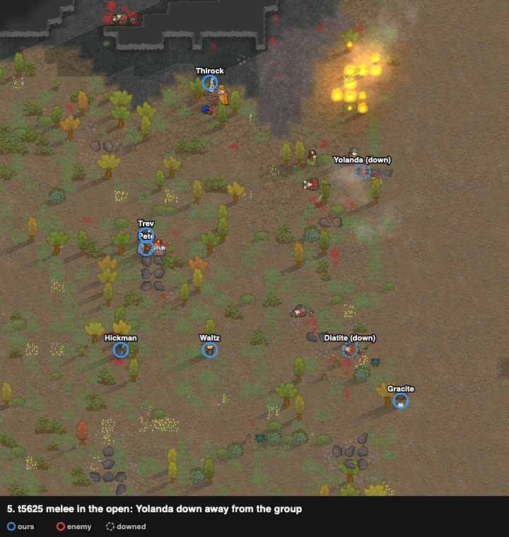
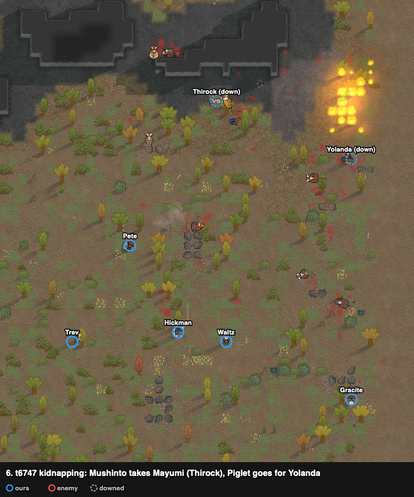
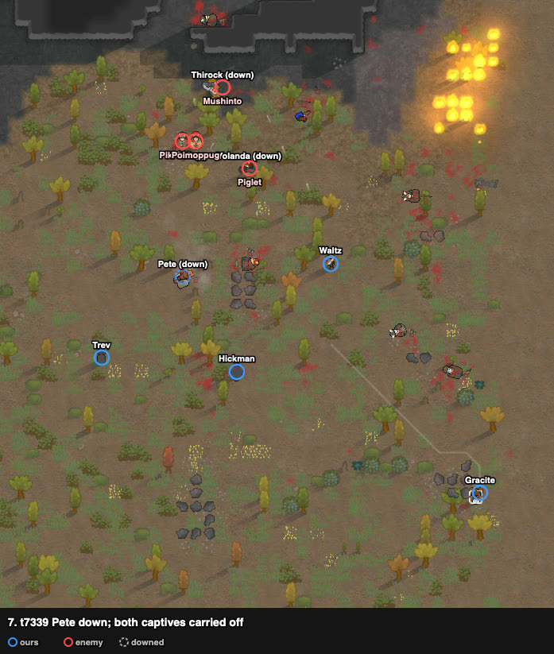

# rand_107: human vs agent (doctrine), low-skill gunners vs three grenadiers

Worst-list #1 of the router night run. Both lost (raid left with captives); the human lost 4,
the agent 6, and the human killed more.

**Problem.** arena_open_night (the forest arena with a cleared square in the middle), Strive to
Survive, 500 v 500 pt. Our squad starts in the cleared ground; the raid starts at the north-west
edge, about 160 cells away.

| ours (9 outlanders; map name) | weapon | shooting / melee |
|---|---|---|
| Pete | autopistol (good) | **8 / 11** |
| Dan | pump shotgun (poor) | 0 / 10, brawler |
| Ivo (Hickman) | heavy SMG | 2 / 8 |
| Mayumi (Thirock) | steel knife (poor) | 5 / 5 |
| Elena (Gracite) | autopistol | 4 / 2 |
| Anton (Waltz) | machine pistol | 3 / 0 |
| Trev | revolver (poor) | 2 / 3 |
| Angus (Diatite) | incendiary launcher | 1 / 5 |
| Yolanda | machine pistol (good) | 0 / 2 |

Enemy (8 pig outlanders): **3 frag grenadiers**, a councilman (revolver), autopistol, 2 pump
shotguns, machine pistol (raiders Pik-Gologg, Mushinto, Poimoppug, Piglet, Nostil, ...).

## Result

| | human | agent (doctrine) |
|---|---|---|
| outcome | raid left with captives (defeat) | raid left with captives (defeat) |
| colonists lost | **4** (Dan, Angus dead; Mayumi, Yolanda kidnapped) | 6 (2 dead, 4 kidnapped) |
| raiders out | **4** | 3 |
| raiders escaped | 3 | 5 |
| HP lost (sum) | 586% | 731% |
| badness | 96.4 (76.4 without the double count) | 142.2 (102.2) |

The router chose `doctrine` (focus fire) because the briefing showed only weapon ranges, not
skills; with shooting 0–4 for everyone but Pete, focus fire had little to hit with.

## Route

The raid's positions were not recorded until the end (the dashed line is start to end only).

## Timeline

The squad leaves the cleared ground for the forest edge to the west.

Holding the forest edge: frags land short or in empty ground; nobody down until t3780, 2700
ticks after first contact.

Angus (Diatite), alone on the east side, is the first one down (t3780 "needs rescue").

The fight turns into melee in the open (Nostil on Pete, Mushinto on Mayumi); Dan is already
dead; Yolanda goes down away from the group.

The raid gives up and kidnaps (t6578): Mushinto takes Mayumi, Piglet goes for Yolanda, the two
others cover them.

Pete (the only good fighter) is down; both captives are carried off.

## What worked, what failed

- Worked: forest-edge cover turned an open-ground fight into a cover fight; Pete won his melee.
- Failed: the isolated pawn went down first; later the downed were scattered and could not be
  covered, and nobody reached the two carriers.

## Lessons for the model

- **The briefing needs skills and weapon quality** before the router picks (this problem was
  chosen wrong for lack of them).
- **No isolated pawns** (frame 4) and **pull the downed back into the group** (frames 5–6).
- **Kidnap response:** carriers become the top targets; the nearest pawns move onto their path
  (frames 6–7).

## Data

- row: `results/human/play.jsonl` (rand_107, agent `human`); agent row: `results/night/router.jsonl`
- watcher records: `../raw/rand_107/` (raider positions only in the last records); frames:
  `../raw/build_reports.py`. No trace.
