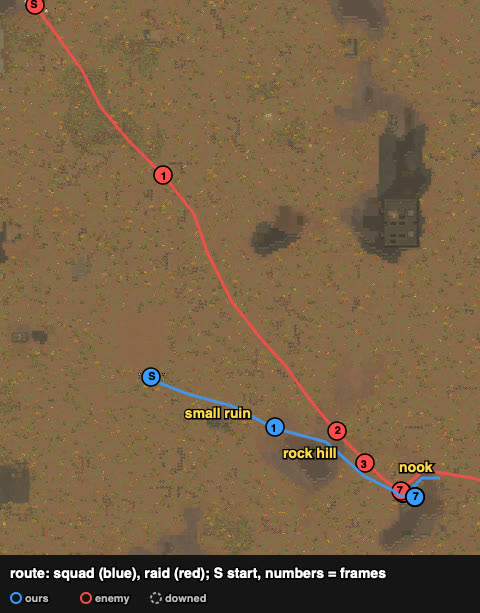
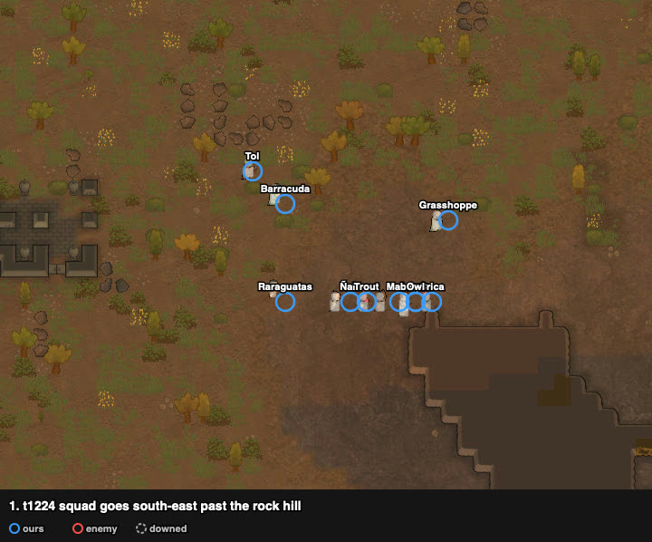
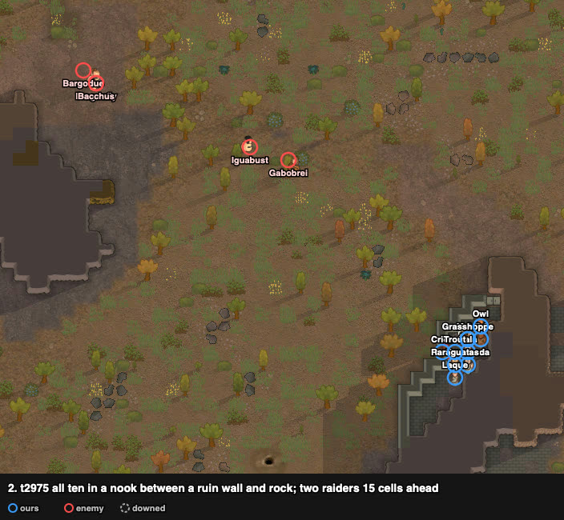
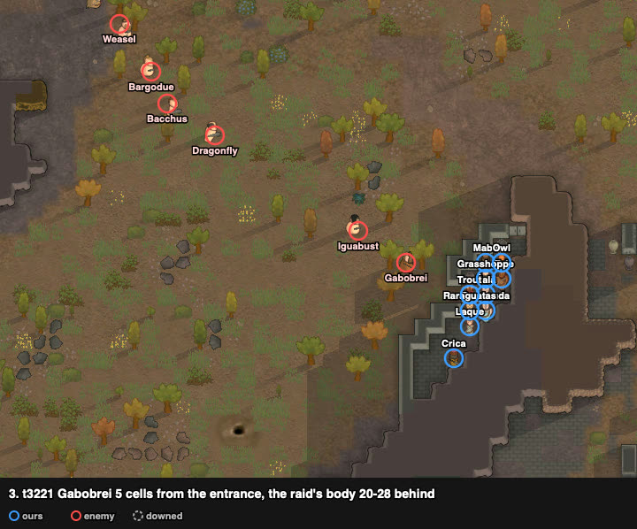
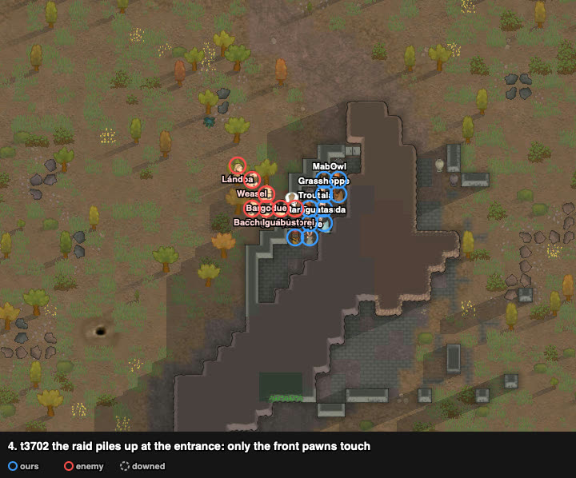
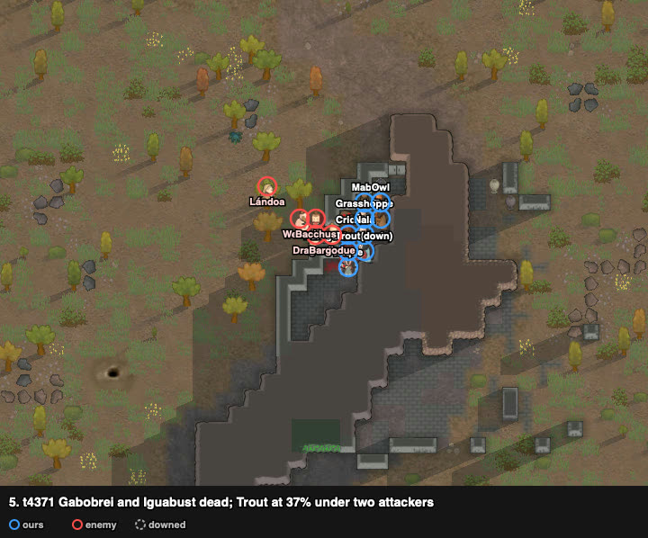
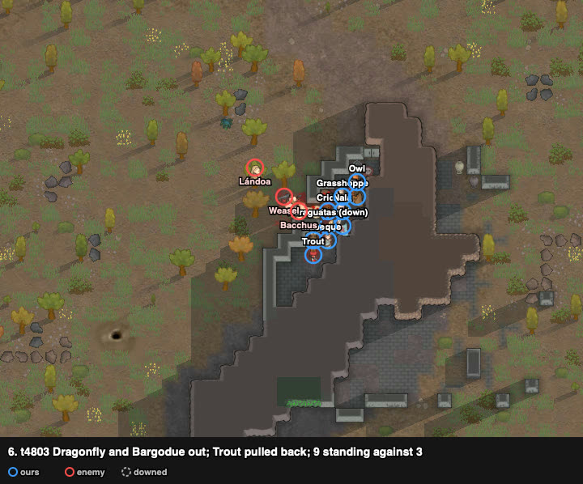
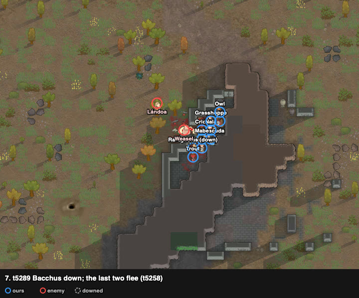

# rand_127: human + Claude's loadout vs agent (amove), savage tribe vs a Neanderthal melee raid

Worst-list #5. Third attempt: the first was abandoned (t2231), the second (an open-ground
melee with the squad packed) was discarded by the player and is kept only in `discarded.jsonl`.
The third, in a narrow nook, repelled the raid with no one lost.

**Problem.** arena_forest_night, Strive to Survive, 500 v 500 pt. The raid starts at the north
edge, 130 cells away.

| ours (10 tribals) | shooting / melee | weapon |
|---|---|---|
| Barracuda | **10 / 11** | short bow (poor) |
| Laque | 8 / 9 | short bow (poor) |
| Crica | 1 / **10** | steel ikwa (poor) |
| Mabe | 2 / **7** | pila → **steel ikwa** (loadout) |
| Trout | 4 / 6 | steel ikwa (awful) |
| Grasshopper | **4** / 1 | steel ikwa → **pila** (loadout) |
| Tol, Owl | 3 / 4, 3 / 2 | short bows (poor) |
| Ñala | 1 / 4 | short bow (poor) |
| Raraguatas | 0 / 4, no clothes | wooden club |

Enemy (7 Neanderthals): six melee (**Bacchus** steel club, melee 9; Gabobrei steel spear;
three knives; a club) and one archer. Neanderthals (wiki): strong melee damage, robust (about
×1.33 health), reduced pain (hard to down), 96% of our speed. Melee skills are low (2–4) except
Bacchus; the race makes them strong.

## Result

| | human + loadout (nook) | human, attempt 2 (open ground, discarded) | agent (amove) |
|---|---|---|---|
| outcome | **repelled** (raid fled at t5258) | squad down (defeat) | squad down (defeat) |
| colonists lost | **0** | 2 dead | 0 (all 10 downed) |
| downed at end | **1** | 8 | 10 |
| permanent injuries | 7 | 8 | 25 |
| raiders out | **5** | 1 | 0 |
| HP lost (sum) | **226%** | 735% | 673% |
| badness | **26.0** | 99.4 | 116.9 |

## Route

From the trace. The squad went south-east past the rock hill into a nook between an ancient
ruin's wall and rock, open only to the north-west.

## Timeline

All ten in the nook (squad radius 3.1 cells when the raid came within 15). The two fastest
raiders run 15 cells ahead of the rest.

Gabobrei is 5 cells from the entrance; the raid's body is 20–28 cells behind.

The raid piles up at the entrance. Only the pawns at the mouth touch the enemy; the others wait
behind them.

Gabobrei and Iguabust dead. Trout (37%) is being hit by two.

Trout pulled back inside, a fresh pawn takes the front; Dragonfly and Bargodue out. Nine
standing against three.

Bacchus down; the raid flees (t5258).

## Why it worked (and attempt 2 didn't)

Same squad, same raid, same loadout. In attempt 2 the squad also packed tightly and the raid
also arrived one or two at a time, but on open ground the Neanderthals surrounded each fighter
and won every exchange (Gabobrei held Trout for 1000+ ticks). In the nook:

1. **Only the mouth fights.** Two or three of ours against one or two of theirs at a time, with
   the rest of the squad as a reserve.
2. **Rotation.** A wounded front pawn steps back and a fresh one steps in (frame 6); on open
   ground there is no "back".
3. **The downed stay inside.** Raraguatas, the only one down, lay behind the front pawns and
   nobody could carry him off.

## Lessons for the model

- **Tactical play: hold a narrow mouth** (nook, door, gap ≤ 3 cells) against a melee raid
  that is stronger one on one, with **rotation** of wounded front pawns.
- **Strategic: the site decides this matchup.** The same play on open ground lost; the router
  must look for a site that affords the play, not only pick a doctrine. (See the design note in
  TODO: tactical repertoire first, battlefield selection on top of it.)
- **Points ≠ strength across xenotypes:** 7 Neanderthals at 500 pt beat 10 tribals at 500 pt
  in the open twice (agent and human). Check how raid points price xenotypes before reading
  such problems as doctrine failures.

## Data

- row: `results/human/play.jsonl` (rand_127, `human_loadout`); attempt 2: `results/human/discarded.jsonl`;
  agent row: `results/night/router.jsonl`
- traces: `../traces/rand_127_human_loadout_20261005-064050.jsonl.gz` (attempt 3), `_try1`, `_try2`
- watcher records and notes: `../raw/rand_127/`; frames: `../raw/build_reports.py`
